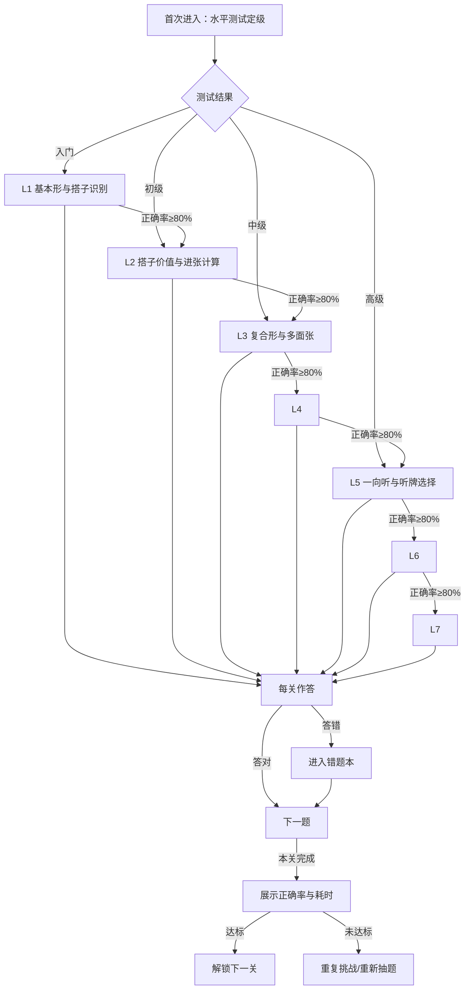

# 麻将拆搭练习教学 App 产品需求文档（PRD）

> **文档性质**：本文档面向「麻将拆搭练习教学 App」的单人开发场景（一人兼任产品、研发、内容）。
> **核心定位**：通用打法下的拆搭/切牌（何切）专项训练工具，**内容为主、核心功能离线可用**。
> **联网策略**：适度联网（题库远程更新、版本检查、远程配置），**无用户系统**——不注册、不登录、不收集用户行为数据、不做个性化。
> **理论基础**：以 G·ウザク《麻将学习·牌效率》为教学骨架，以 79博客和《Riichi Book I》为理论补充与交叉验证。
> **版本**：v4.0（适度联网 + 无用户系统版）

---

## 一、背景与用户问题

### 1.1 背景

麻将玩家提升水平的关键瓶颈在于「该打哪张」的决策——即拆搭/切牌选择。这一决策基于**牌效率理论**：以最快完成「4组面子 + 1组雀头」为目标，选择进张概率最有利的切牌。

现有学习资料以书籍和博客为主，存在以下问题：

- **理论难转化**：看书能懂，实战用不出来
- **缺乏练习载体**：没有「练习 + 即时反馈」的工具化形式
- **反馈缺失**：不知道自己切牌对不对、为什么错

### 1.2 目标用户与任务情境

| 用户画像 | 任务情境 | 核心痛点 |
|---|---|---|
| 刚入门玩家（会打但不懂牌效） | 打牌凭感觉，输多赢少 | 不知道什么是「好牌理」，切牌没有依据 |
| 中级玩家（想系统提升） | 希望把「进张数/搭子价值」练成直觉 | 看书能懂，实战用不出来，缺练习载体 |
| 高阶玩家（备考/冲段） | 刷「何切」题保持手感、查漏补缺 | 缺乏高质量、可即时判分讲解的题库 |

---

## 二、参考资料体系

### 2.1 核心教材（教学骨架）

| 资料 | 性质 | 文字版获取方式 | 状态 |
|---|---|---|---|
| 《麻将学习·牌效率》（G·ウザク） | 日文牌效率专著，中文社区公认最系统的牌效率「辞典」 | 日文原版（三才ブックス 2019）；中文翻译散见于 B站/知乎专栏，**完整性待核实** | ⚠️ 中文翻译需逐章确认 |

**作为核心教材的理由**：结构最清晰，按牌型形状（基本形→复合形→听牌形）分类讲解牌效率，天然适合作为 App 训练关卡的设计依据。作者也是《何切300》《何切301》等经典习题集的作者，理论与题目高度一致。

> **说明**：G·ウザク原书为日文出版物，无官方中文完整版。本 App 仅参考其**理论体系与分类框架**，不复制原文表述。中文讲解文案以 79博客（已确认完整中文）为主要文字来源，ウザク理论用于交叉验证。

### 2.2 理论补充与交叉验证（已确认可用）

| 资料 | 性质 | 文字版获取方式 | 状态 |
|---|---|---|---|
| 《Seventh9 日麻教程》（79博客） | 中文免费公开教程（340页） | 已下载全文 PDF（hunque.top 镜像）；NGA 社区有百度网盘分享（提取码 79mj） | ✅ 完整可用 |
| 《Riichi Book I》（Daina Chiba） | 英文免费公开书（CC BY-NC 3.0） | GitHub 开源 PDF（dainachiba/RiichiBooks）；riichi.wiki 有全文 | ✅ 完整可用 |
| 星野 Poteto 日麻牌效率系列（十三讲） | 中文免费专栏 | 知乎/B站专栏，文字可复制 | ✅ 可用（中文牌效补充） |

**补充价值**：79博客覆盖牌效率、手役、防守、攻守判断全体系；Riichi Book I 提供五搭子法、防守判断等不同理论视角；星野 Poteto 十三讲提供中文牌效的另一种表述。三者均可与ウザク理论交叉验证。

### 2.3 题库思路参考（非直接引用）

| 参考来源 | 性质 | 使用方式 |
|---|---|---|
| 《何切300》《何切301》习题集 | 经典习题集（商业出版物，无免费完整版） | 参考其题型和出题思路，**手牌组合与讲解文案均为本项目原创编写** |

> ⚠️ **版权边界**：本 App 的理论内容以 G·ウザク《麻将学习·牌效率》的理论体系为骨架，79博客与 Riichi Book I 为补充。所有题目文案、讲解文案均为本项目**原创编写**，不复制受版权保护的具体表述。

---

## 三、产品目标与结果指标

### 3.1 产品定位

一款「拆搭/何切」专项训练 App：聚焦麻将最高频的核心决策「该打哪张」，通过「题库练习 + 即时讲解 + 分类进阶」帮助玩家把牌效率理论练成直觉。

**内容为主**：App 的核心价值是高质量题库与讲解，而非社交、账号或游戏化功能。

**适度联网、无用户系统**：
- 允许联网获取服务器信息（题库远程更新、版本检查、远程配置），使内容可以不依赖发版迭代
- **不做用户注册/登录**，所有训练进度、错题本、水平测试结果均存储在本地
- **不收集用户行为数据**，不做个性化推荐、用户画像或数据分析
- 核心功能（做题、判分、讲解、错题本）在断网状态下完全可用

### 3.2 产品目标

1. **认知目标**：让用户能判断「一手牌应该切哪张」，并理解「为什么」——以进张数/搭子价值为核心依据
2. **路径目标**：提供从基础到高阶的分层训练路径，循序渐进
3. **闭环目标**：形成「练习 → 即时反馈 → 错题复习」的完整学习闭环

### 3.3 可观测结果指标

| 指标 | 口径 | 目标值 |
|---|---|---|
| 题库规模 | 上线时可用的分类练习题总数 | ≥200题（各分类均匀分布） |
| 训练完成度 | 用户完成至少1个分类训练的比例 | ≥60%（上线后3个月） |
| 正确率提升 | 同一用户完成某分类前后正确率对比 | 平均提升≥15个百分点 |

---

## 四、范围与非目标

### 4.1 V1 范围内

- ✅ 通用打法下的拆搭/切牌判断题（何切）训练
- ✅ 基于牌型形态的 7 级训练分类体系
- ✅ 即时判分 + 每题讲解（含进张数对比、理论依据与出处）
- ✅ 学习闭环：分类训练、错题本、水平测试
- ✅ **核心功能离线可用**：题库与讲解本地静态加载，断网可做题
- ✅ **适度联网**：题库远程更新（增量拉取新题）、版本检查、远程配置开关

### 4.2 V1 明确不做

- ❌ 完整对局/真人/AI对战
- ❌ 牌谱导入与复盘分析
- ❌ 地方麻将规则适配
- ❌ 赖子/红中/百搭等变体玩法
- ❌ **用户注册/登录/账号系统**（无用户体系，所有数据本地存储）
- ❌ **用户行为数据收集、用户画像、个性化推荐**
- ❌ **每日一题/打卡/签到**（非内容核心，且增加联网复杂度）
- ❌ **成就/连击/排行榜**（游戏化激励，非内容核心）
- ❌ 社交/社区/评论/分享功能

### 4.3 优先级标注

| 功能 | 优先级 | 说明 |
|---|---|---|
| 何切题库（分类 + 即时判分 + 讲解） | **P0** | 产品核心 |
| 进张数/最优切牌计算引擎 | **P0** | 判分与讲解的技术底座 |
| 训练分类体系与关卡树 | **P0** | 内容组织骨架 |
| 本地存储（进度/错题本/水平测试结果） | **P0** | 无用户系统下的数据持久化 |
| 错题本 | **P1** | 学习闭环必备 |
| 水平测试（定级） | **P1** | 引导用户进入合适难度 |
| 题库远程更新接口（增量拉取新题） | **P1** | 内容不依赖发版迭代 |
| 版本检查与远程配置 | **P2** | 轻量联网能力，可后置 |
| 题库管理/内容编辑工具 | **P1** | 内容建设的内部工具 |

---

## 五、训练分类体系（内容核心）

### 5.1 设计依据

训练分类体系以 G·ウザク《麻将学习·牌效率》的牌型分类方法为骨架——该书按牌型形状从简单到复杂逐步深入地讲解牌效率，天然适合作为训练关卡的组织逻辑。同时参考 79博客的章节结构（基础→牌效率→防守→攻守判断）与 Riichi Book I 的五搭子法框架。

### 5.2 七级训练分类

| 级别 | 分类名称 | 难度 | 训练内容 | 核心理论依据 |
|---|---|---|---|---|
| **L1** | 基本形与搭子识别 | ★☆☆☆☆ | 认识面子与搭子（两面/嵌张/边张/对子），区分完成形与未完成形，识别手牌中的搭子 | G·ウザク：基本形的分类；79博客：麻雀的基础4「面子和搭子」 |
| **L2** | 搭子价值与进张计算 | ★★☆☆☆ | 进张数计算、搭子优劣排序、浮牌取舍、有效牌张数枚举 | G·ウザク：搭子比较；79博客：牌效率2「有效牌和张数」、牌效率3「浮牌理论」 |
| **L3** | 复合形与多面张 | ★★★☆☆ | 三张/四张复合型（两嵌、搭子+浮牌、中膨形、亚两面、四连形等）、多面张的进张优势识别 | G·ウザク：复合形的分类与处理；79博客：麻雀的基础8-10「基本形与复合型」；Riichi Book I：Ch3.3 Complex shapes |
| **L4** | 五搭子原理与拆搭 | ★★★☆☆ | 五搭原理、冗余张识别、搭子超载时的拆搭选择、六搭→五搭的整理思路 | G·ウザク：搭子过剩余的拆解；Riichi Book I：Ch4 The five-block method；79博客：牌效率4-7「搭子理论」 |
| **L5** | 一向听与听牌选择 | ★★★★☆ | 一向听牌理、听牌形式优化（双碰/嵌张/两面/单骑的选择）、和了率比较 | G·ウザク：听牌形的比较；79博客：牌效率13-19「一向听、听牌时的牌理」 |
| **L6** | 改良与向听倒退 | ★★★★☆ | 改良进张的考量、向听倒退的利弊、是否保留好形变化的判断 | 79博客：牌效率20「向听倒退」；Riichi Book I：改良与牺牲 |
| **L7** | 综合判断（含攻守） | ★★★★★ | 结合打点、安全度、局况的切牌判断，防守读牌基础 | 79博客：第七章「防守」、第九章「攻守判断」；Riichi Book I：Ch7-8 立直与防守判断 |

> 💡 **设计理念**：从 L1 到 L7，每级对应一种新的牌型复杂度或决策维度，让用户逐步建立「从识别→比较→拆解→综合」的牌效率思维链。

### 5.3 搭子价值排序（核心理论）

79博客明确给出的搭子优劣排序：

> **两面 > 两嵌 > 嵌张 > 边张**

- **两面**（如 45）：2种 8 张进张，最好形
- **两嵌**（如 135）：2种 8 张进张，与两面同数，但需3张牌
- **嵌张**（如 46）：1种 4 张进张
- **边张**（如 12）：1种 4 张进张，且难变两面
- **对子**：特殊形，可做雀头或刻子，不纳入上述排序

### 5.4 训练路径与关卡流程

用户从「L1 基本形与搭子识别」起步，逐级解锁，形成**入门 → 初级 → 中级 → 高级**的进阶路径。每个分类内含若干关卡，每关一组题目（建议 8-12 题），答完即时判分并展示讲解。



### 5.5 题目形态

| 形态 | 说明 | 占比建议 | 示例（原创） |
|---|---|---|---|
| 何切判断 | 展示14张手牌，选择应切掉的一张 | **70%+**（核心题型） | 手牌 123m 567p 34p 789p 66s 8s，应切哪张？ |
| 进张数比较 | 给定两种切法，判断哪种进张更多 | 15% | 切3饼 vs 切4饼，哪种听牌张数更多？ |
| 搭子识别 | 从手牌中找出所有搭子并分类 | 10% | 指出手牌中的两面/嵌张/边张搭子各有哪些 |
| 听牌选择 | 判断哪种听牌形式更优（和了率/打点） | 5% | 双碰 vs 嵌张 vs 单骑，选择听牌留法 |

> 💡 **内容原创性**：所有题目文案为本项目原创编写。题目类型与考察点参考教材的例题思路，但具体手牌组合、讲解文案均自建，避免复制受版权保护的具体表述。

---

## 六、关键场景与行为需求

### 6.1 场景一：完成一题何切训练

| 需求 | 验收标准 |
|---|---|
| 用户在「何切」分类下开始一题，看到14张手牌并选择要切的一张牌 | 点选某张牌后，系统即时判定对错；正确切牌与用户所选不一致时给出明确提示 |
| 题目展示后提供「查看讲解」入口 | 讲解至少包含：最优切牌、进张数对比（各候选切牌的进张数）、理论依据及出处 |
| 用户答错后题目进入错题本 | 错题本中出现该题，可从错题本重新作答 |

### 6.2 场景二：完成一个分类训练

| 需求 | 验收标准 |
|---|---|
| 用户进入某分类的关卡，完成一组题目 | 完成后展示本关正确率、耗时；正确率达标（默认≥80%）则解锁下一关 |
| 未达标的关卡可重复挑战 | 重复挑战时题目可重新抽题或复用原题，进度可记录 |

### 6.3 场景三：水平测试定级

| 需求 | 验收标准 |
|---|---|
| 首次进入 App 可进行水平测试（约10题，覆盖 L1-L7 各分类） | 测试结束给出等级（入门/初级/中级/高级）并推荐起始分类 |
| 测试结果可重新评测 | 提供「重新测试」入口，重新测试覆盖旧结果 |

### 6.4 异常与边界行为

| 异常/边界 | 行为 |
|---|---|
| 题库题目不足导致某关无法抽满题量 | 允许重复用题，界面提示「该关卡题库较少，可能复现」；内容建设期逐步补齐 |
| 无网络/弱网环境 | 核心功能（做题、判分、讲解、错题本）使用本地缓存题库，**完全离线可用**；联网功能（题库更新、版本检查）静默失败，不干扰用户，下次联网时自动重试 |
| 题库远程更新失败 | 使用本地已有题库继续运行，提示「题库更新失败，将在下次联网时重试」；不阻塞用户做题 |
| 用户中途退出训练 | 记录已完成题目进度到本地存储，下次进入可继续或重新开始 |
| 特殊牌型（如七对子）判定 | 明确按通用规则：何切主流程按4面子1雀头标准形计算，七对子可标注为特殊情况 |
| 本地数据清除 | 用户卸载或清除缓存后，训练进度/错题本/水平测试结果全部丢失（无云端备份，因无用户系统）；在设置中明确提示 |

---

## 七、核心引擎需求（技术关键点）

### 7.1 进张数计算引擎

- **输入**：13张/14张手牌（V1 无副露）
- **输出**：向听数、每张可切牌的进张数与听牌机会张数、最优切牌排序
- **理论依据**：79博客「牌效率2—有效牌和张数」的进张数定义；Riichi Book I Ch3 的牌效计算；G·ウザク「搭子比较」的排序逻辑

### 7.2 最优切牌判定

- 综合打分：**进张数优先**（基础），其次比较改良（79博客明确「进张数优先于改良」）
- L7 综合判断引入打点与安全度权重，V1 主流程以进张数为准

### 7.3 讲解文案生成

- 每题配置预写讲解（题库人工编写），含「最优解 + 进张数对比 + 理论出处」三段结构
- V1 不做 AI 实时生成，保证讲解质量与出处可控

### 7.4 联网与数据存储（无用户系统）

**联网能力（适度）**：

| 联网场景 | 触发时机 | 数据流向 | 失败处理 |
|---|---|---|---|
| 题库增量更新 | App 启动时 / 手动检查 | 服务器 → 客户端（拉取新题 JSON） | 静默失败，使用本地题库，下次重试 |
| 版本检查 | App 启动时 | 服务器 → 客户端（最新版本号） | 静默失败，不提示 |
| 远程配置 | App 启动时 | 服务器 → 客户端（功能开关、题库版本号） | 使用默认本地配置 |

**不做的联网行为**：
- 不上传任何用户数据（做题记录、错题、进度均只存本地）
- 不做用户注册/登录/Token 鉴权
- 不做埋点、统计、行为分析
- 不做推送通知

**本地数据存储**：

| 数据 | 存储方式 | 说明 |
|---|---|---|
| 题库内容 | 本地 JSON / 数据库 | 内置基础题库 + 增量更新合并 |
| 训练进度 | 本地存储（关卡解锁状态、正确率） | 无账号，仅本机有效 |
| 错题本 | 本地数据库 | 按题目 ID 存储，支持重做 |
| 水平测试结果 | 本地存储 | 最近一次测试等级与推荐起始分类 |
| 题库版本号 | 本地存储 | 用于增量更新比对 |

> ⚠️ **数据丢失说明**：因无用户系统、无云端备份，用户卸载 App 或清除缓存后，所有训练进度与错题本将丢失。需在设置页或首次启动时明确提示用户。

---

## 八、适用质量约束

| 维度 | 可验证门槛 |
|---|---|
| 判分正确性 | 计算引擎对题库内全部题目的最优切牌判定，与教材例题结论一致；用独立实现（如第三方何切工具）抽测比对≥20题一致 |
| 讲解可追溯 | 每道题的讲解包含出处标注；出处对应章节在教材中可定位 |
| 离线可用 | 断网状态下 V1 全部功能可用 |
| 响应速度 | 单题判分与讲解展示≤1s（本地计算） |

---

## 九、依赖与开放问题

### 9.1 依赖

- **进张数计算引擎**：依赖规则引擎的向听数/进张枚举实现（技术方案文档另行定义）
- **题库内容**：依赖开发者按本 PRD 的七级分类体系人工编写题目与讲解（≥200题）

### 9.2 开放问题

| 问题 | 影响 | 建议 |
|---|---|---|
| 交付载体：微信小程序/Web/App？ | 影响技术选型与题库加载方式 | 建议优先 Web 或小程序，便于迭代 |
| 通用规则的默认定义：是否含「赤宝牌/役种限制」？ | 影响听牌/攻守分类的出题 | V1 以「进张数为准、不含役种强迫」简化处理 |
| G·ウザク中文翻译的完整性 | 影响理论出处的中文表述 | 以79博客为中文主来源，ウザク仅作框架参考 |
| 题库规模确认 | 影响关卡设计与内容排期 | V1 ≥200题，各分类均匀分布 |
| 后续扩展（赖子玩法、对局、复盘）排期 | 影响产品路线图 | 纳入 V2/V3 规划，不在 V1 承诺 |

---

## 十、参考资料与获取方式汇总

| 资料 | 获取方式 | 本 PRD 引用范围 | 状态 |
|---|---|---|---|
| 《麻将学习·牌效率》（G·ウザク） | 日文原版；中文翻译散见 B站/知乎（完整性待核实） | **教学骨架**：七级分类体系的底层逻辑、牌型分类方法 | ⚠️ 中文需核实 |
| 《Seventh9 日麻教程》（79博客） | 已下载全文 PDF（340页）；NGA 百度网盘分享 | 牌效率、防守、攻守判断等全体系的理论补充与交叉验证 | ✅ 完整 |
| 《Riichi Book I》（Daina Chiba） | GitHub 开源 PDF（CC BY-NC 3.0）；riichi.wiki 全文 | 五搭子法、复杂形、防守判断等框架补充 | ✅ 完整 |
| 星野 Poteto 日麻牌效率十三讲 | 知乎/B站专栏，文字可复制 | 中文牌效表述的补充参考 | ✅ 可用 |
| 《何切300》《何切301》 | 商业出版物（无免费完整版）；B站/贴吧有散落单题解析 | 题库题型与出题思路参考（**不复制原文**） | ⚠️ 仅思路 |

---

## 附录：题库建设计划

### A.1 各分类建议题量分布

| 分类 | 建议题量 | 关卡数建议 |
|---|---|---|
| L1 基本形与搭子识别 | 30题 | 3关 × 10题 |
| L2 搭子价值与进张计算 | 35题 | 3关 × 约12题 |
| L3 复合形与多面张 | 30题 | 3关 × 10题 |
| L4 五搭子原理与拆搭 | 40题 | 4关 × 10题 |
| L5 一向听与听牌选择 | 30题 | 3关 × 10题 |
| L6 改良与向听倒退 | 20题 | 2关 × 10题 |
| L7 综合判断 | 15题 | 2关 × 约8题 |
| **合计** | **200题** | — |

### A.2 单题数据结构

```json
{
  "id": "L1_001",
  "level": "L1",
  "category": "基本形与搭子识别",
  "hand": ["1m","2m","3m","5m","6m","3p","4p","5p","6p","7p","8p","2s","2s","4s"],
  "correct_discard": "4s",
  "candidates": [
    {"discard": "4s", "shanten": 1, "tile_count": 16},
    {"discard": "8p", "shanten": 2, "tile_count": 12}
  ],
  "explanation": "最优切牌是4s。切4s后保留...（理论依据：G·ウザク《麻将学习·牌效率》基本形分类；79博客「麻雀的基础4—面子和搭子」）",
  "source": "G·ウザク《麻将学习·牌效率》基本形 / 79博客 麻雀的基础4"
}
```

### A.3 出题规范（保证题目不是随机出的）

每道题必须满足以下规范，否则不入库：

1. **有明确考察点**：每题对应 L1-L7 中某一级的某个具体知识点（如「两嵌识别」「边张 vs 嵌张取舍」）
2. **覆盖经典牌型**：题库必须覆盖教材中列出的全部经典牌型（两面、嵌张、边张、两嵌、搭子+浮牌、中膨形、亚两面、四连形等），不得遗漏
3. **最优解唯一或可排序**：每题的最优切牌必须由进张数计算引擎验证，存在多解时按进张数排序并在讲解中说明
4. **讲解三段式**：最优解 + 进张数对比 + 理论出处，缺一不可
5. **难度标注**：每题标注难度（简单/中等/困难），与所在级别匹配

---

**文档版本**：v4.0（适度联网 + 无用户系统版）
**更新日期**：2026-08-31
**适用阶段**：V1 开发准备期
**与 v3.0 的主要变更**：
1. 联网策略从「完全离线」调整为「适度联网」：允许题库远程更新、版本检查、远程配置
2. 明确「无用户系统」：不注册、不登录、不收集用户行为数据、不做个性化
3. 新增 7.4「联网与数据存储」小节：定义联网场景、数据流向、失败处理、本地存储方案
4. 优先级表新增「本地存储」P0、「题库远程更新接口」P1、「版本检查与远程配置」P2
5. 异常边界新增「题库远程更新失败」「本地数据清除」两种场景
6. 非目标新增「用户注册/登录/账号系统」「用户行为数据收集与个性化」
**与 v2.0 的主要变更（继承自 v3.0）**：
1. 去除每日一题/打卡/成就/排行榜等联网与游戏化功能
2. 强化「内容为主」定位
3. 修正 L2 搭子排序（两面>两嵌>嵌张>边张，对子不纳入排序）
4. 修正单题数据结构示例进张数（改为合理值 16/12）
5. zefuriku 翻译与 beginners.biz 链接因未核实可用性，改为已确认来源并标注状态
6. 新增「搭子价值排序」独立小节（5.3）
7. 新增「出题规范」（A.3），明确题目不是随机生成
