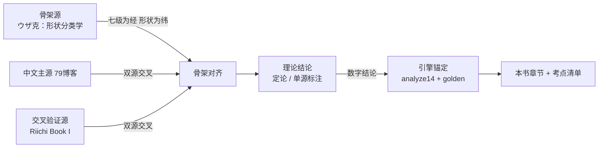
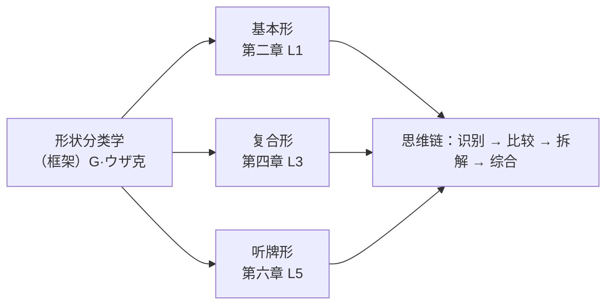
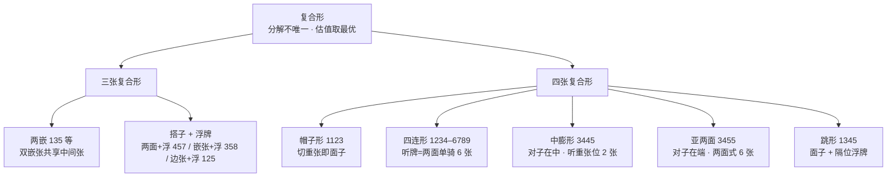
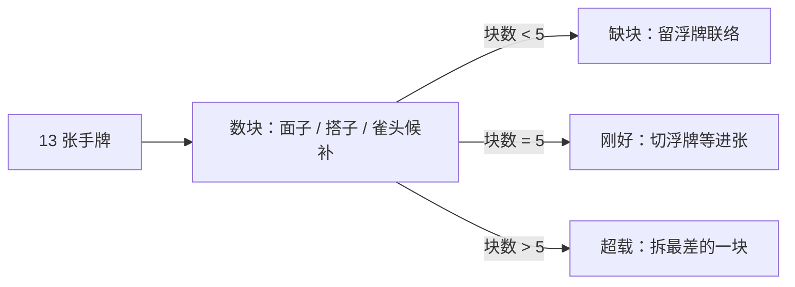

# 牌效率理论基础

> **文档性质**：何切训练的内容创作内参——理论表述、术语标准、讲解措辞、考察点清单的唯一权威（四文档分工见 §1.3）。
> 本文**不是**给 App 用户的教材；若将来面向用户改写，以本文档为蓝本另行撰写。
> **版本**：v1.0（2026-09-02）｜**上游文档**：PRD（需求范围）、SOURCES.md（资料与版权）、engine.md（数学口径）——冲突时以上游为准。
> 全文档例数字一律附「引擎核验行」，可复制命令重跑；牌面配图由 `content/build/hand-svg.ts` 生成（换牌面皮肤只改 `content/build/tile-skin.ts` 后重跑，见附录 B）。

## 前言

本书回答两个问题：**这套训练的理论从哪里来、怎么整合的**（第一章）；**整合之后的完整理论体系长什么样**（第二至八章）。

写作对象是本项目的内容创作者——出题人与讲解作者。因此每章在理论展开之外，末尾都有一节「出题考点」：其中的 `knowledge_point` 措辞可以直接复制进题库 JSON，附录 A 汇总了全七级的考点总清单（即 question-bank.md §五① 所要求的「考察点清单」的正式载体）。

全书结构与七级训练分类一一对应：第二章对应 L1，第三章对应 L2，依次到第八章对应 L7。但理论本身是连续的整体，章节边界是教学切分而非知识边界——读的时候建议顺序读，写题的时候按级跳读。

**阅读约定**：

- 手牌记法：`123m 456p 789s 46s 55s`——紧凑分块，空格即分块（分块本身就是第一章要教的整理手牌动作）；花色 m 万、p 饼、s 索，字牌 E/S/W/N（风）、f（發）、c（中）、h（白），与题库 JSON 的 `hand` 字段完全一致
- 每个牌例 = 牌面图 + 记法 + 分析 + 引擎核验行（`> 引擎核验：…`）。**正文禁止出现未经核验的数字**
- 「V1 判定边界」提示框：标记理论正确但**不进入**当前判分引擎的结论，出题时须按框内规则处理

**拆分条件**：本文超出 3 万字，或出现其他文档需要按章深链时，拆为 `docs/theory/chNN-*.md` + 目录索引；在此之前维持单文件。

## 目录

1. [理论体系来源与整合方法](#一理论体系来源与整合方法)
2. [基本概念：面子、搭子与和了形（L1）](#二基本概念面子搭子与和了形l1)
3. [进张、向听数与搭子价值（L2）](#三进张向听数与搭子价值l2)
4. [复合形与多面张（L3）](#四复合形与多面张l3)
5. [五搭子原理与拆搭选择（L4）](#五五搭子原理与拆搭选择l4)
6. [一向听与听牌形式选择（L5）](#六一向听与听牌形式选择l5)
7. [改良与向听倒退（L6）](#七改良与向听倒退l6)
8. [超越速度：打点、安全与攻守（L7）](#八超越速度打点安全与攻守l7)
9. [术语规范、记法与口径总表](#九术语规范记法与口径总表)
- [附录 A 出题考点总索引](#附录-a-出题考点总索引)｜[附录 B 牌例索引与校验状态](#附录-b-牌例索引与校验状态)｜[附录 C 修订记录](#附录-c-修订记录)

---

## 一、理论体系来源与整合方法

### 1.1 三源一锚

本项目没有一本可以直接照搬的「教科书」：最系统的牌效率专著是日文商业出版物（不能复制表述），中文资料最全的博客不按我们的关卡结构组织，英文开源书的视角又不完全一致。因此理论底座是**整合**出来的，结构为「三源一锚」：

| 角色 | 资料 | 贡献什么 | 不贡献什么 | 引用格式 |
|---|---|---|---|---|
| **骨架源** | G·ウザク《麻将学习·牌效率》（商业书，不入库） | 形状分类学：**基本形 → 复合形 → 听牌形** 三段递进，以及「按牌型形状组织教学」的思想——七级分类的底层逻辑 | 任何具体表述、例题文字、页码级引用（版权红线，原书不持有） | `（框架）G·ウザ克 分类骨架` |
| **中文主源** | 79博客（Seventh9 日麻教程，340 页 PDF，仅本地保留） | 中文理论实质：麻雀的基础 + 牌效率 + 防守 + 攻守判断全体系；L1-L7 全部章节出处；golden 用例的教材锚定 | 英文视角；本项目专有口径 | `79博客·牌效率2『有效牌和张数』` |
| **交叉验证源** | Riichi Book I（Daina Chiba，CC BY-NC 3.0，已入库） | 独立视角下的复杂形（Ch3.3）、五搭子法（Ch4）、防守（Ch7-8）——与 79 博客互为印证 | 中文表述（英文原文引用须署名、非商用） | `Riichi Book I Ch4` |
| **数学锚** | 本项目引擎 + golden 用例集 | 一切数字结论的最终裁判：向听数、进张张数、最优切牌 | ——不是外部资料，是自家实现 | 引擎核验行 |

在线补充源（星野 Poteto 十三讲、キンマweb 何切る、riichi.wiki 等）按 SOURCES.md §二 的用法按需查阅，不落盘、不进出处标注。

**版权红线如何塑造整合方式**（CLAUDE.md 红线在本项目的落地）：

1. 不持有《麻将学习·牌效率》《何切300/301》的任何电子版或原文表述——ウザ克只留分类框架层；
2. 本书全部表述原创撰写。写作纪律：不逐句对照原文；成稿抽查判据为**任意连续 20 字不与参考资料原文重合**（专有名词与固定牌型名除外）；
3. 出处只标章节定位（勾稽表见 SOURCES.md §五，每个出处均可定位到页码）；79 博客不贴原图截图，图表一律自绘重排；Riichi Book I 直引英文须署名。

### 1.2 整合方法：三步



**第一步，骨架对齐**。以七级训练分类为「经」、牌型形状复杂度为「纬」排布全部知识点：每个理论概念都必须落到某个（级， 形状）格子里，放不进格子的内容要么属于 V2（手役、宝牌、鸣牌、立直——本书不展开），要么不该存在。这一步保证「理论体系 ↔ 训练关卡 ↔ 题库考察点」三者同构。

**第二步，双源交叉**。79 博客与 Riichi Book I 都讲过的结论（如搭子价值排序、五搭子法、复合形类目），视为**定论**直接采用；只有单方讲过的（如 79 的「向听倒退」专章表述），本书标注**单源**。单源结论不影响出题（数字仍由引擎裁决），只影响讲解措辞的谨慎程度。

**第三步，引擎锚定**。一切数字结论（向听数、进张张数、最优切牌集合）以引擎输出为准，正文数字必须来自引擎核验行。理论书的数字与引擎不一致时：先疑理论（翻译/口径差异），核对后记入勘误流程——数学上两者应当一致（同为标准形定义下的必然结论），不一致说明口径没对齐，这正是 golden 用例集存在的意义。

**缺口管理**：目前唯一已知缺口是「ウザ克式复合形细类目命名」——79 博客对部分细类覆盖不足。处理规则（SOURCES.md §四）：出题到 L3 时按需在线核对公开翻译的框架；核对不到的类目用本项目自拟名并在第四章类目表中标注「自拟」。

### 1.3 四文档裁决分工

| 问题 | 唯一权威 | 说明 |
|---|---|---|
| 需求范围：级别划分、题型、题量、搭子排序等**结论条目** | `docs/prd/PRD_…_v4.md` | PRD 存结论；本书存「为什么、怎么讲」。冲突时**先改 PRD 再改本书**（文档先行铁律） |
| 资料与版权：能用什么资料、引用边界 | `docs/references/SOURCES.md` | 本书不引入清单外资料；出处勾稽以 SOURCES.md §五 为总索引 |
| 数学口径：向听数、进张张数、最优切牌定义 | `docs/requirements/engine.md` + golden 用例集 | 本书复述口径但**不另行定义**；发现矛盾按勘误流程回溯引擎 |
| 理论表述、术语、讲解措辞、考察点清单 | **本书** | 题库讲解文案的措辞标准以本书第九章为准 |

### 1.4 使用方式

- **出题**：按级翻到对应章 → 读「出题考点」小节选定 `knowledge_point` → 按 PRD A.3 规范构造手牌 → `content/build/probe.ts` 核验数字 → 写三段式讲解（出处格式见 §9.4）→ verify CLI 入库
- **写讲解**：术语用词查 §9.1 标准术语表；语气与结构参照 `content/questions/L1.json` 现有题目（分块 → 结论 → 数字 → 反例预告）
- **查出处**：SOURCES.md §五 勾稽表是章节定位总索引，本书正文出处只落到章节名

---

## 二、基本概念：面子、搭子与和了形（L1）

### 2.1 目标函数与手牌整理

一切讨论的出发点：**和了形 = 4 组面子 + 1 组雀头**。整手牌 13 张（自摸前）永远在向这个目标逼近；「何切」要回答的，是哪一张牌离目标最远、切掉它之后向目标逼近的速度最快。

把 14 张手牌**分块**（面子一块、搭子一块、雀头一块、剩下的浮牌各一块）是第一项基本功，也是本书所有记法里空格的含义。分块之后，牌效率问题就变成了块的问题：哪些块已经完成、哪些块在等待、哪些牌不属于任何块。


**例 2-1**（复用 L1_001）　`123m 456m 789p 1s 2s E E N`
分块：123m、456m、789p 三副完成面子；EE 雀头；1s2s 边张搭子；N——不是面子、不是搭子、也当不了雀头（雀头已由 EE 占位），是唯一游离在块体系之外的牌。切 N 后 13 张 = 三面子 + 雀头 + 搭子，**听牌**，等 3s。

> 引擎核验：npx tsx content/build/probe.ts "1m 2m 3m 4m 5m 6m 7p 8p 9p 1s 2s E E N"
> 输出：最优 [N] · 切后 0 向听 · 进张 4 张 [3s]

> **V1 判定边界**：七对子、国士无双不在 V1 判定范围（PRD 6.4）。出题遇到时按特殊情况标注，不进主流程。

### 2.2 完成形：顺子与刻子

面子只有两种：

- **顺子**：同花色连续三张，如 456m。只有数牌（万饼索）能组顺子，字牌没有顺子。
- **刻子**：完全相同的三张，如 777s。数牌、字牌都可以。

完成块不需要再动。一个常见的初学错误是把已有的面子拆开来迁就别处（见例 2-6）。

### 2.3 未完成形：搭子的基本形

搭子是「差一张成为面子的两张组合」。数牌搭子按形状分三种，加上对子，共四种基本形：

| 搭子 | 形状例 | 进张 | 张数 | 说明 |
|---|---|---|---|---|
| **两面** | 3p4p | 2p、5p | 2 种 8 张 | 最好形：两头都能进 |
| **嵌张** | 3p5p | 4p | 1 种 4 张 | 只等中间 |
| **边张** | 1p2p | 3p | 1 种 4 张 | 只等一端，且到头了 |
| **对子** | 5p5p | 5p | 1 种 2 张 | 特殊形，见 §2.4 |

同一个「等一张」，三者的差别一图看清——三手牌只差搭子形状：

**例 2-2**（复用 G01）两面　`123m 456m 789s 3p 4p 5s 5s`

听 **2p / 5p 两种共 8 张**。3p4p 摸哪头都能成面子，是搭子里唯一的「两面下注」。

> 引擎核验：复用 golden G01（0 向听 · waits [2p 5p] · 8 张）

**例 2-3**（复用 G02）嵌张　`123m 456m 789s 3p 5p 5s 5s`

听 **4p 一种 4 张**。隔一张的搭子只有中间一个答案。

> 引擎核验：复用 golden G02（0 向听 · waits [4p] · 4 张）

**例 2-4**（复用 G03）边张　`123m 456m 789s 1p 2p 5s 5s`

听 **3p 一种 4 张**。1p2p 和 8p9p 是搭子的「死角」：只有一端可等，且这一端到 3p/7p 就封顶，永无两面化的可能。

> 引擎核验：复用 golden G03（0 向听 · waits [3p] · 4 张）

> 💡 **讲解提示**：两面 8 张、嵌张/边张 4 张这组数字是全书出现频率最高的结论，题库讲解可直接引用本节。

### 2.4 对子的双重身份

对子不进入 §3.3 的搭子排序，因为它是**特殊形**——有两条出路，价值随局面浮动：

1. **当雀头**：一副和了形只需要一个雀头。雀头已定时，其余对子只剩第 2 条路。
2. **升刻子**：摸第三张变成刻子，即「对子 = 刻子候补的搭子」。

**例 2-5**（复用 G05）双碰听　`123m 456m 789s 4p 4p 5s 5s`

两个对子同时挂出刻子候补，听 **4p / 5s 两种各 2 张（共 4 张）**：手内 4p 已有 2 张、5s 已有 2 张，各自只剩 2 张可摸。这是「对子当搭子用」的标准形态（双碰）。

> 引擎核验：复用 golden G05（0 向听 · waits [4p 5s] · 4 张）

对子身份的浮动性正是 L4「对子过剩」、L5「双碰 vs 两面选择」这些高阶话题的来源，此处先立概念。

### 2.5 雀头识别的陷阱

雀头识别最常见的错误：手牌里同时出现「对子 + 相邻搭子」时，误把对子拆去组面子。

**例 2-6**（复用 L1_003）　`11m 2m 3m 456p 123p 789s E`

正确分块：1m1m **雀头**、2m3m 两面搭、三副面子。切 E 后听 **1m / 4m 共 6 张**——注意 1m 手内已有 2 张，只剩 2 张可摸（4 张 − 2 张），4m 完整 4 张，合计 2 + 4 = 6 张。
错误分块：把 123m 当面子、E 当单骑雀头——只剩 3 张。**对子先问「能不能当雀头」，再考虑拆**。

> 引擎核验：复用 L1_003 engine_snapshot（切 E：0 向听 · 6 张 [1m 4m]；切 1m：0 向听 · 3 张 [E]）

### 2.6 基本形总图

（框架）G·ウザ克 分类骨架把牌的形状分成三段递进，本书章节与之对应：



- **基本形**（本章）：面子、四种搭子、雀头——单块的认识
- **复合形**（第四章）：块与块共享牌张的重叠结构
- **听牌形**（第六章）：最后一搭的形态比较

介于其间的第三章给出比较基本形的**度量衡**（进张、向听数、价值排序），第四章之后所有判断都建立在这套度量上。

### 2.7 出题考点（L1）

| knowledge_point | 题型建议 | 难度 | 易错点 |
|---|---|---|---|
| 孤立字牌识别：面子 / 搭子 / 雀头之外的最无用牌 | what_to_discard | easy | 误切搭子保字牌（现题 L1_001） |
| 孤张与两面搭的分辨：切谁一听便知 | what_to_discard | easy | 数牌孤张「看着有用」舍不得切（现题 L1_002） |
| 雀头识别：对子固定作雀头后搭子成立 | what_to_discard | easy | 误拆完整面子迁就雀头（现题 L1_003） |
| 听牌张数对比：两面 vs 单骑 | ukeire_compare | easy | 忽略手内已占的扣减（现题 L1_004） |
| 搭子分类：两面 / 嵌张 / 边张 / 对子的辨认 | mentsu_identify | easy | 24 与 68 判嵌张靠边的方向搞反 |
| 完成形与未完成形的区分：三副块各归其位 | mentsu_identify | easy | 对子归搭子还是雀头分不清 |
| 对子的双重身份：雀头或刻子候补 | mentsu_identify | medium | 双碰听的进张按 4 张记（实为 2+2） |

---

## 三、进张、向听数与搭子价值（L2）

### 3.1 进张与张数口径

**进张**：使向听数减少 1 的摸牌（79博客术语「有效牌」，本书统一「进张」）。切掉一张牌后，能使剩下 13 张向听数下降的所有牌，构成这手切法的进张集合。

**张数口径**（全书统一，engine.md 定义）：每种进张的可摸张数 = **4 − 手内该牌张数**。手内已有 1 张的进张只剩 3 张；对子搭子的第三张只剩 2 张。V1 不考虑他家可见牌、副露、宝牌指示——讲解文案**禁止**出现「可能被别人吃了所以剩不了几张」类表述。

**例 3-1**（复用 L1_004）　`11m 2m 3m 456p 123p 789s E`

两种切法都听牌，差别全在「和了牌还剩几张」：切 E 听两面 1m / 4m——1m 手内已占 2 张只剩 **2** 张、4m 完整 **4** 张，合计 **6 张**；切 1m 单骑 E——手内 1 张剩 **3** 张。6 > 3，切 E。

> 引擎核验：复用 L1_004 engine_snapshot（切 E：6 张 [1m 4m]；切 1m：3 张 [E]）

### 3.2 向听数

**向听数** = 距离听牌还差几轮有效进张。公式（engine.md 口径，此处仅作解释）：

```
向听数 = 8 − 2×面子数 − min(搭子数, 4−面子数) − 雀头
```

- 8 是起点：4 面子 + 1 雀头共需 5 个块，每块贡献 2（面子）或 1（搭子/雀头）；
- `min(搭子数, 4−面子数)`：**面子位只有 4 个**。面子已满 4 后，多余搭子不再产生进度——这是最容易算错的一项。反例（engine.md 记录）：1 面子 + 4 搭子 + 雀头的手牌，直觉按「差 3 面子但有 4 个搭子候补」算 1 向听，实际为 **2 向听**：面子位只剩 3 个，第 4 个搭子多余。

**例 3-2**（复用 G10）　`123m 456m 789s 1p 2p 4s 5s`

分块：3 面子 + 2 搭子（12p、45s）+ 无雀头。代入：8 − 6 − min(2, 1) − 0 = **1 向听**。注意两个搭子只有 1 个面子空位可用——但这不损失什么，因为谁先到位谁占位。

进张构成（「拆开看」是一向听计算的基本功）：**完成类**——3p（成 123p）、3s / 6s（成 345s / 456s）各 4 张；**雀头类**——手内已有的 1p 2p 4s 5s 各 3 张（摸成对子即充当雀头）。合计 3×4 + 4×3 = **24 张**。无雀头的一向听，进张 = 完成类 + 雀头类，这个拆解在 L4、L5 的讲解里反复出现。

> 引擎核验：复用 golden G10（1 向听 · waits [1p 2p 3p 3s 4s 5s 6s] · 24 张）

### 3.3 搭子价值排序：两面 > 两嵌 > 嵌张 > 边张

排序的依据是三条，按重要性排列：

1. **进张张数**：两面 2 种 8 张，其余 1 种 4 张。这是数量级的差距，也是排序的第一依据。
2. **改良余地**（搭子变成更好搭子的可能）：边张 1p2p 摸 4p 升级为 24p 两面；嵌张 3p5p 摸 6p 升级为 56p 两面（摸 2p 变 23p 边张是劣化方向，通常不选）；两面则是「吃下一张仍是好形」——45p 摸 6p 后 56p 依然是两面。改良余地越大的搭子，后续变化的空间越大。
3. **耗牌数**：两面、嵌张、边张都只占 2 张牌，对子的身份浮动。

**两嵌**（135 型）是排序里最容易被误解的一档。先看一个辨析例：

**例 3-3**　`123m 456m 789p 1s 3s 5s 5s E`

直觉上「135s 是两嵌，应该等 2s / 4s 两面 8 张」——**错**。雀头 55s 已把第二张 5s 占用，索子实际分块是 **13s 嵌张 + 55s 雀头**，只听 2s 一种 4 张。「两嵌」从来不是一种**听牌形式**，它说的是**搭子**：135 三张作为一个搭子候补时的进张结构。

> 引擎核验：npx tsx content/build/probe.ts "1m 2m 3m 4m 5m 6m 7p 8p 9p 1s 3s 5s 5s E"
> 输出：最优 [E] · 切后 0 向听 · 进张 4 张 [2s]

两嵌真正的舞台在一向听：

**例 3-4**　`123m 456m 135p 45s 77s E`

分块：2 面子 + 135p（两嵌）+ 45s（两面）+ 77s 雀头 = 8 − 4 − min(2,2) − 1 = 1 向听。进张：两嵌给 **2p / 4p 各 4 张**，两面给 **3s / 6s 各 4 张**，合计 **16 张**。

> 引擎核验：npx tsx content/build/probe.ts "1m 2m 3m 4m 5m 6m 1p 3p 5p 4s 5s 7s 7s E"
> 输出：最优 [E] · 切后 1 向听 · 进张 16 张 [2p 4p 3s 6s]

于是排序的完整逻辑（79博客·牌效率2 的结论，本书补论证）：

> **两面 > 两嵌 > 嵌张 > 边张**；对子特殊形不参与排序。

- 两面 vs 两嵌：同为 2 种 8 张，但**两嵌多占一张牌**——例 3-4 里 135p 占 3 张，同样 8 张进张的两面只占 2 张；这张多出来的牌在别处本可做浮牌或对子。所以两面 > 两嵌。
- 两嵌 vs 嵌张：2 种 8 张 vs 1 种 4 张，多花一张牌买翻倍的进张种类，值——所以两嵌 > 嵌张。
- 嵌张 vs 边张：同为 1 种 4 张，嵌张还保留两端继续联络的可能（35 摸 6 成 56 新搭），边张到头。所以嵌张 > 边张。

### 3.4 浮牌：不属于任何块的牌

不属于面子、搭子、雀头候补的牌叫**浮牌**（79博客·牌效率3「浮牌理论」）。L1 语境下叫「孤张」强调识别（认识它不在块体系里）；L2 之后进入价值比较，统一叫「浮牌」——它不是垃圾，是**待用的联络资源**。

浮牌的价值取决于它将来接上搭子的可能性，梯度（定性口径，V1 不做精确概率）：

```
客风字牌 < 役牌 / 自风字牌 < 1 / 9 < 2 / 8 < 3–7 中张
```

依据是联络面的宽窄：3–7 的数牌两端都可能有伙伴（如 5 的联络牌 3–7 五种）；2 / 8 一端半；1 / 9 一端；字牌零。由此得到浮牌处理的基本法则——**先切端、后切中；先切字、后切数**。

**例 3-5**（复用 L2_001）　`123m 456m 789p 1s 2s 4s 5s E`

分块：三面子 + 1s2s 边张搭 + 4s5s 两面搭 + 浮牌 E。两个搭子正好覆盖第 4 个面子位，切 E 后 1 向听、进张覆盖 **1s–6s 六种 20 张**。E 无法参与任何块，按梯度也是最先离场的牌——「不能让手牌前进的牌先切」。

> 引擎核验：复用 L2_001 engine_snapshot（切 E：1 向听 · 20 张 [1s 2s 3s 4s 5s 6s]）

> 💡 **讲解提示**：浮牌梯度只在「同为难舍的浮牌之间」比较。当手牌存在字牌浮牌与数牌浮牌时几乎总是先切字牌；但若切牌候选是「浮牌 vs 完成块的一部分」，永远保块——例 2-1 的反例（切 1s 保 N）向听数直接变差。

### 3.5 出题考点（L2）

| knowledge_point | 题型建议 | 难度 | 易错点 |
|---|---|---|---|
| 进张张数口径：剩余张数 = 4 − 手内张数 | what_to_discard | easy | 对子搭子第三张按 4 张记（现题 L2_002） |
| 浮牌理论：孤立字牌让位给两面搭 | what_to_discard | medium | 「字牌留着安全」直觉（现题 L2_001） |
| 嵌张搭子：3s5s 型只等中间一张 | what_to_discard | easy | 把嵌张当两面数进张（现题 L2_003） |
| 保搭 vs 拆搭：双两面并进的进张面 | what_to_discard | medium | 拆搭后进张面塌缩没察觉（现题 L2_004） |
| 搭子排序应用：两面 > 两嵌 > 嵌张 > 边张 | ukeire_compare | medium | 两嵌与两面张数相同就以为完全等价 |
| 两嵌辨析：听牌形里的 135 是嵌张 + 雀头 | what_to_discard | hard | 把「两嵌听牌 8 张」当成听牌形式 |
| 浮牌价值梯度：字牌 → 端数 → 中张的舍弃顺序 | what_to_discard | medium | 先切 3–7 中张浮牌（反直觉） |
| 向听数判读：搭子上限的修正 | （讲解引用） | — | 1 面子 + 4 搭子 + 雀头误判 1 向听（实为 2） |

---

## 四、复合形与多面张（L3）

第三章把搭子当作独立单元逐个估值。但实战手牌里，数牌常常「叠」在一起：几张牌同时属于两种读法，一张牌同时服务面子与雀头两个位置。这类结构叫**复合形**（79 章节原名「复合型」，本文档术语统一作「形」；Riichi Book I §3.3 称 compound shapes）。本章类目经双源核对：79 博客与 Riichi Book I 的形状集合一致，中文命名取 79 体系。

### 4.1 定义：分解不唯一，估值取最优

**复合形**：一组同花色数牌，存在不止一种「面子 / 搭子 / 雀头候补」的切分方式，不同切分在不同局面下各有最优。评估复合形时**不指定唯一分解，而是取当前局面下向听数最优的那种读法**——这也是引擎的实现行为：向听数对全部分解取最小值（见 engine.md 口径表）。因此复合形不是「多算搭子」的漏洞：例 3-2 的搭子上限修正（1 面子 + 4 搭子 + 雀头实为 2 向听）对复合形同样生效。

**例 4-1**　`123m 789m 789s 4556p E`

饼子四张 4556p 至少有三种读法：

- **456 面子 + 5p 单骑候补**——切 E 后即听牌，单骑 5p；
- **55 雀头 + 46 嵌张搭**——切 E 后同样是听牌，嵌张等 5p；
- **45 两面 + 56 两面**——双搭并进，保持 1 向听的大进张面。

前两种读法的听牌竟重合在同一张 5p 上（单骑与嵌张殊途同归）。这手牌三条路线的引擎判定：

| 切牌 | 切后 | 进张 |
|---|---|---|
| 5p | 听牌 | 单骑 E，3 张 |
| E | 听牌 | 5p，2 张 |
| 4p | 1 向听 | 2p–6p + E，20 张 |

> 引擎核验：npx tsx content/build/probe.ts "1m 2m 3m 7m 8m 9m 7s 8s 9s 4p 5p 5p 6p E" → 最优 [5p]：切 5p 0 向听 3 张 [E]；切 E 0 向听 2 张 [5p]；切 4p 1 向听 20 张

按 V1 口径（向听数优先于张数）最优是切 5p 听牌；「听牌 3 张 vs 一向听 20 张」的抉择是第五章的正面议题。这里先记住复合形的本质价值：**一枚两用，进张面板按全部读法的并集展开**。

### 4.2 三张复合形：两嵌与搭子加浮牌

| 类目 | 通用型 | 读法 | 进张特征 |
|---|---|---|---|
| 两嵌 | 135 / 246 / 357 / 468 / 579（首尾两型互为镜像，实际三种结构） | 两个嵌张共享中间张（1_3 与 3_5） | 成搭 2 种 8 张；转对 2 种各 3 张 |
| 两面 + 浮牌 | 如 457（两面搭 + 贴身浮牌） | 两面搭 + 雀头候补 | 成搭 2 种 8 张；转对 2 种各 3 张 |
| 嵌张 + 浮牌 | 如 358 | 嵌张搭 + 浮牌 | 成搭 1 种 4 张；浮牌侧另有转对 |
| 边张 + 浮牌 | 如 125 | 边张搭 + 浮牌 | 成搭 1 种 4 张；浮牌侧另有转对 |

出处：79博客·麻雀的基础8『基本形与复合型』；Riichi Book I §3.3（Table 3.2 同族）。「对子 + 浮牌」（如 558）第三章 2.4 对子双重身份已覆盖，不重列。

三张复合形的教学重点不是背表，是看清**进张的双路径**。对照下面两手：

**例 4-2**　`123m 456m 789p 135s E W`

**例 4-3**　`123m 456m 789p 457s E W`

两手都是切 E（或 W，并列）后 1 向听、进张 5 种 17 张，构成却不同：

| | 成搭路径 | 转对路径 | 雀头路径 |
|---|---|---|---|
| 例 4-2 两嵌 135s | 2s、4s（各 4 张） | 1s、5s（各 3 张） | W（3 张） |
| 例 4-3 两面+浮 457s | 3s、6s（各 4 张） | 4s、7s（各 3 张） | W（3 张） |

> 引擎核验：probe "1m 2m 3m 4m 5m 6m 7p 8p 9p 1s 3s 5s E W" → 最优 [E W]：切 E 1 向听 17 张 [1s 2s 4s 5s W]；probe "…4s 5s 7s E W" → 最优 [E W]：切 E 1 向听 17 张 [3s 4s 6s 7s W]

张数完全相同，**质量不同**：例 4-3 摸 4s 后剩 57 两面（听 6s/8s 8 张），例 4-2 摸 1s 后剩 35 嵌张（听 4s 4 张）——搭子加浮牌的转对路径通向好形，两嵌的转对路径通向愚形。V1 判定只看张数（两手并列），讲解文案应当点出这层差异。

> 💡 **讲解提示**：两嵌的「成搭 2 种 8 张」与两面张数相同，这就是 3.3 节排序里两嵌紧随两面之后的原因；但转对后剩余搭子的质量（两面 vs 嵌张）才是两者的分水岭。出题时这是「张数相同、结构不同」的天然对照组。

### 4.3 四张复合形：五型类目

| 类目 | 通用型 | 读法 | 听牌形态（该块成为最后一块时） |
|---|---|---|---|
| 帽子形 | 1123 | 对子与顺子重叠，切重张即面子 | 例 4-6：双碰 |
| 四连形 | 1234–6789 六型（两端型只有单侧延伸，中四连 3456/4567 最强） | 雀头候补 + 顺子候补 | 两面单骑，2 种 6 张（golden 公理） |
| 中膨形 | 2334 / 3445 / 4556 …（X X+1 X+1 X+2） | 顺子 + 重张；或对子 + 嵌张 | 单骑重张位，1 种 2 张 |
| 亚两面 | 3455 型（X X+1 X+2 X+2） | 顺子 + 雀头候补；或两面 + 对子 | 两面式，2 种 6 张 |
| 跳形 | 1345 | 面子 + 隔位浮牌 | 单骑浮牌位，1 种 3 张（与切浮牌改单骑等价） |

出处：79博客·麻雀的基础8『基本形与复合型』；Riichi Book I §3.3.2（nobetan / nakabukure / skipping 与前三行一一对应；「亚两面」「帽子形」为 79 体系命名）。

中膨形与亚两面是**对子位置决定命运**的一对：两者都是「顺子 + 重张」，但中膨形的对子叠在搭子中间（4556 的 55），抽出来当雀头后剩 46 嵌张；亚两面的对子叠在端上（3455 的 55），抽出来当雀头后剩 34 两面。同为 4 张牌，听牌质量一个 2 张、一个 6 张。

**例 4-4**（四连形）　`123m 456m 789p 3456s E`

切 E 即听牌：3456s 按「顺子 + 单骑」读，两面单骑 3s/6s——手内各 1 张、各剩 3 张，共 2 种 6 张（golden 结构族公理，例 4-4 为其新牌面实例）。

> 引擎核验：npx tsx content/build/probe.ts "1m 2m 3m 4m 5m 6m 7p 8p 9p 3s 4s 5s 6s E" → 最优 [E]：切 E 0 向听 6 张 [3s 6s]

**例 4-5**（亚两面）　`123m 456m 789p 3455s E`

切 E 即听牌，且是两面式 6 张：按「34 两面 + 55 雀头」读，等 2s（4 张）与 5s（2 张）。对照 4.1 的例 4-1：同为「顺子 + 重张」的中膨形 4556 切 E 后只能听重张位 5p 2 张——对子在端与在中的差别一目了然。

> 引擎核验：npx tsx content/build/probe.ts "1m 2m 3m 4m 5m 6m 7p 8p 9p 3s 4s 5s 5s E" → 最优 [E]：切 E 0 向听 6 张 [2s 5s]

**例 4-6**（帽子形，复用 L3_001）　`1123m 456p 789s 55s EE`

11m 与 23m 重叠成帽：切一张 1m，剩 123m 直接是完整面子，55s 与 EE 两对留作双碰。**四张里其实只多一张**——不需要把 11m 和 23m 当两个独立搭子去纠结。

> 引擎核验：复用 L3_001 engine_snapshot（切 1m：0 向听 4 张 [5s E]，双碰各剩 2）

### 4.4 复合形进张计算法：读法并集

给讲解作者的可复算方法，三步：

1. **列读法**：写出复合形的全部「面子 / 搭子 / 雀头候补」分配方式；
2. **逐读法列进张**：每个未完成位置按三类路径枚举——成搭（搭子变面子）、转对（某张成对充当雀头，剩余部分重读）、雀头（孤张成对）；
3. **取并集计张数**：每种进张按「4 − 手内张数」计入，重复牌只计一次。

**例 4-7**（复用 L3_002）　`123m 789p 23456s 55p6p`

饼子六张 556789p 是「对子 + 四连」的复合：切 6p 剩 55 + 789，切 9p 剩 55 + 678，两种读法结构完全等价、并列最优。留下的是「完整面子 + 55 雀头」加索子五连——23456s 以「面子 + 单骑」读，和牌是 1s（组成 123 + 456）、4s（组成 234 + 456）、7s（组成 234 + 567）：三面听 11 张（1s、7s 各 4 张，4s 手内 1 张剩 3 张）。

> 引擎核验：复用 L3_002 engine_snapshot（切 6p / 9p 并列：0 向听 11 张 [1s 4s 7s]）

**例 4-8**（复用 L3_004）　`123m 789p 23456s 56p E`

切 E 后 1 向听、进张 13 种 42 张——复合形弹性的极限展示。按三步法归组：

| 路径 | 牌 | 张数 |
|---|---|---|
| 饼子成搭 | 4p（56p→456） | 4 |
| 饼子转对 | 5p、6p（56p 成对充雀头） | 各 3 |
| 饼子面子侧延伸 | 7p、8p、9p（789p 侧多出面子或雀头） | 各 3 |
| 五连两端延伸 | 1s、7s（各自再组成一副面子） | 各 4 |
| 五连内部转对 | 2s、3s、5s、6s（重张充雀头） | 各 3 |

> 引擎核验：复用 L3_004 engine_snapshot（切 E：1 向听 42 张 [4p 5p 6p 7p 8p 9p 1s 2s 3s 4s 5s 6s 7s]，饼 19 + 索 23）

作为反例，切 5p 拆掉一面搭子，进张立刻塌缩到 6 种 20 张（L3_004 的对照项）——**复合形的价值就在「一张牌同时服务多种完成方式」，拆开就没了**。



### 4.5 出题考点（L3）

| knowledge_point | 题型建议 | 难度 | 易错点 |
|---|---|---|---|
| 四张复合形（帽子形）：112m 切重张即成面子 | what_to_discard | medium | 把 11m 和 23m 当两个独立搭子纠结（现题 L3_001） |
| 四连 + 对子复合：556p 的三面听结构 | what_to_discard | hard | 看不出切 6p/9p 等价并列（现题 L3_002） |
| 一色长连：八连张的两端三面听 | what_to_discard | medium | 切中间只剩单骑一种解（现题 L3_003） |
| 五连 + 两面：复合形进张的并集有多大 | ukeire_compare | hard | 切复合形一端后进张塌缩没察觉（现题 L3_004） |
| 分解不唯一：复合形按最优读法估值 | ukeire_compare | hard | 固定一种分解漏算进张（如 4556 只看两面双搭） |
| 两嵌双路径：成搭与转对各自通向的听牌 | what_to_discard | medium | 张数同 17 就认为两嵌与两面+浮牌等价 |
| 中膨形听牌：单骑重张位的差听识别 | what_to_discard | medium | 误当中膨 4556 与亚两面 3455 同强度 |
| 亚两面听牌：对子在端的两面式 6 张 | what_to_discard | medium | 只见 345 顺子不见 34+55 读法 |
| 四连形听牌：两面单骑 2 种 6 张 | what_to_discard | easy | 以为四连听牌是两面 8 张（漏扣手内张数） |
| 跳形识别：隔位浮牌不拆既有面子 | what_to_discard | easy | 把 1345 的 1 当成可组搭子硬留 |

---

## 五、五搭子原理与拆搭选择（L4）

前四章都在「搭子够不够」的语境里估值。L4 的核心问题反过来：**块够了、甚至多了，切哪张？**

### 5.1 五搭子法：把 13 张牌看成 5 个块

和了形 = 4 面子 + 1 雀头，共 **5 个块**。整理手牌时把 13 张牌切分成：完成的面子、未完成的搭子、雀头候补（对子），剩下的就是浮牌。数一数，与 5 比较（Riichi Book I Ch4 五搭子法；79博客·牌效率4-7『搭子理论 / 切牌选择的思考方法』）：

- **块数不足**（面子 + 搭子 + 对子 < 5）：缺口靠摸牌补，浮牌留联络价值高的；
- **块数刚好**：切浮牌，等进张；
- **块数超载**（搭子 + 面子 > 4，或对子 > 1）：有冗余张，要拆——拆谁，是 L4 的主战场。



**例 5-1**　`123m 456p 789s 12m 55s E`

数块：三面子 + 12m 边张搭 + 55s 雀头候补 = **5 块齐**，E 是唯一的浮牌。切 E 即听牌（边张听 3m）。这就是「块数刚好」的标准处理——不纠结边张差，先切浮牌进听牌；而切 1m/2m 拆搭退回 1 向听（17 张），向听数直接变差。

> 引擎核验：npx tsx content/build/probe.ts "1m 2m 3m 4p 5p 6p 7s 8s 9s 1m 2m 5s 5s E" → 最优 [E]：切 E 0 向听 3 张 [3m]；切 1m 1 向听 17 张

### 5.2 搭子超载与冗余张：多余牌之间互相等价

搭子满员（面子 + 搭子 > 4 个面子位）时，**超出位置的搭子和不参与任何块的浮牌，进张面板常常相同**——此时切谁不影响向听数与张数，判「并列最优」。

**例 5-2**（复用 L4_002）　`123m 23s 5678s 23p 55p E`

数块：123m 面子、5678s 可读作 678 面子 + 5 浮（或 567 + 8 浮）、23s 两面、23p 两面、55p 雀头——面子 2 个、搭子 3 个（23s / 23p / 四连余端），面子位只有 2 个空缺，超载 1。切 5s、切 8s、切 E 全部并列：1 向听 16 张 [1p 4p 1s 4s]。

> 引擎核验：复用 L4_002 engine_snapshot（切 5s / 8s / E 并列：1 向听 16 张 [1p 4p 1s 4s]）

满员状态还有一层陷阱：**块已够时，浮牌不再比搭子差**——超载的搭子和游离的浮牌同样是「第 13 张」，谁切都一样。

**例 5-5**（复用 L4_005）　`234m 23p 5678p 24s 66s E`

切 E（浮牌）与切 5p / 8p（四连两端）同为 1 向听 12 张 [1p 4p 3s] 并列最优——「满员时浮牌 vs 搭子，一字之差」其实不差。

> 引擎核验：复用 L4_005 engine_snapshot（切 E / 5p / 8p 并列：1 向听 12 张 [1p 4p 3s]）

> 💡 **讲解提示**：出这类题时务必让引擎先跑——「等价并列」的手感不可靠，人工出题容易把某一个选项误设为唯一正确。并列时题库按多 correct 处理（怎么切都不算错），讲解要说明「为什么等价」而不是硬分高下。

### 5.3 拆搭选择：拆最差的一块

必须拆时的标准顺序就是 3.3 节搭子排序的反向应用：**保两面、拆边张；两面 > 两嵌 > 嵌张 > 边张，越靠后越先离场**。再叠加两条修正：

1. **雀头需要**：手里无对子时，拆搭要顾及「拆出来能不能当雀头」，对子价值上升；
2. **位置价值**：嵌张 46 优于嵌张 13（46 周围联络宽，转对后余牌有用），同为嵌张也要比位置。

**例 5-3**（复用 L4_004）　`123m 567m 24p 66p 34s 78s`

数块：两面子 + 24p 嵌张 + 66p 雀头 + 34s 两面 + 78s 两面——搭子 3 个、空位 2 个，超载 1。按排序拆最差：24p 嵌张让位，切 2p / 4p 并列最优（1 向听 16 张，双两面的成搭 2s/5s/6s/9s）。若错拆 3s，进张立刻掉到 12 张。

> 引擎核验：复用 L4_004 engine_snapshot（切 2p / 4p 并列：1 向听 16 张 [2s 5s 6s 9s]；切 3s：12 张）

### 5.4 对子过剩：四对以上，雀头只要一个

雀头只需要一对。**手里超过 3 个对子时（留 1 雀头 + 其余双碰的余地有限），多出的对子要么转刻子（摸第三张）、要么从重叠处拆掉一张**。对子过剩手的特征是「到处都是两张」，块数看着够、实际重叠严重——处理原则是**在重叠处合并**：如 33p + 345p 六张里，33p 与 345p 共享 3p，切一张 3p 即还原「面子 + 干净对子」结构。

**例 5-4**（复用 L4_003）　`22m 567m 3345p 88s WW 9s`

四对子（22m / 33p / 88s / WW）+ 一副面子 + 散张 9s。雀头只要一个，剩下三对的出路是转刻子：进张全落在「第三张」上——2m、7s（89s 成面子）、8s（888）、W（WWW）。最优切 3p（重叠处合并，保 345p 面子），1 向听 10 张 [2m 7s 8s W]；切 9s 则丢掉 789s 的联络，掉到 8 张。

> 引擎核验：复用 L4_003 engine_snapshot（切 3p：1 向听 10 张 [2m 7s 8s W]；切 9s：6 张）

> 💡 **讲解提示**：对子过剩是「隐性超载」——块数表上是 5 块，但多对挤占搭子位。V1 判定照常按张数，讲解文案用「雀头只要一个」开题，落点在「重叠处先合并」。

### 5.5 出题考点（L4）

| knowledge_point | 题型建议 | 难度 | 易错点 |
|---|---|---|---|
| 四连张切端：五连里藏着的面子 + 对子 | what_to_discard | medium | 切中间破坏双解（现题 L4_001） |
| 搭子满员：多余牌之间互相等价 | what_to_discard | hard | 人工预设唯一答案、实际并列（现题 L4_002） |
| 对子过剩：重叠处合并，块数刚好 | what_to_discard | hard | 拆干净对子而非重叠对（现题 L4_003） |
| 拆搭顺序：两面 > 嵌张，拆最弱的一块 | what_to_discard | hard | 拆两面保嵌张（现题 L4_004） |
| 满员时浮牌 vs 搭子：一字之差 4 张 | ukeire_compare | hard | 以为浮牌必劣于搭子（现题 L4_005） |
| 五块数法：面子 + 搭子 + 雀头与 5 的关系判冗余 | what_to_discard | medium | 块数够时还留着搭子数联络 |
| 雀头需要修正：无对时拆搭兼顾生头 | what_to_discard | hard | 拆到听牌时发现无雀头 |

---

## 六、一向听与听牌形式选择（L5）

### 6.1 好形一向听与愚形一向听

一向听（1 向听）是听牌前最后一站，**进张之后落成什么听牌**，决定这一站的质量（79博客·牌效率13-19『一向听的牌理 / 听牌时的牌理』）：

- **好形一向听**：主要进张落地后是两面听（或三面听）；
- **愚形一向听**：主要进张落地后是嵌张 / 边张听。

**例 6-1**　两手对照（均切 E 后 1 向听）
好形：`123m 456m 789p 45s 78s E`

愚形：`123m 456m 789p 13s 46s E`


| | 切 E 后 | 成搭路径 | 落成听牌 |
|---|---|---|---|
| 好形（45s + 78s） | 1 向听 24 张 [3s–9s] | 3s/6s/9s 三种 | 两面听（如摸 3s 后等 6s/9s 8 张） |
| 愚形（13s + 46s） | 1 向听 20 张 [1s–6s] | 2s/5s 两种 | 嵌张听（如摸 2s 后等 5s 4 张） |

> 引擎核验：probe "1m 2m 3m 4m 5m 6m 7p 8p 9p 4s 5s 7s 8s E" → 最优 [E]：1 向听 24 张；probe "…1s 3s 4s 6s E" → 最优 [E]：1 向听 20 张

好形不仅总张数多 4 张，**成搭路径的张数差更大**（12 张 vs 8 张）——愚形的进张里有一半是转对路径，慢且间接。V1 判定只看总张数，两个数字都是引擎实测；讲解文案按「落成听牌的强弱」展开。

### 6.2 听牌形式全表（golden 公理）

听牌形态与张数是引擎的结构公理（golden 结构族 63 例全绿），出题与讲解直接引用：

| 听牌形式 | 例 | 种数 × 张数 | 依据 |
|---|---|---|---|
| 两面听 | 34 + 雀头 | 2 种 8 张 | golden 结构族（18 例） |
| 嵌张听 | 13 / 24 / … + 雀头 | 1 种 4 张 | golden 结构族（21 例） |
| 边张听 | 12 / 89 + 雀头 | 1 种 4 张 | golden 结构族（6 例） |
| 双碰听 | 两对子 | 2 种各剩 2 张 | golden 结构族（6 例） |
| 单骑听 | 单张（含字牌） | 1 种剩 3 张 | golden 结构族（8 例） |
| 四连两面单骑 | 3456 + 其余完成 | 2 种各剩 3 张 | golden 结构族（4 例） |

三个易错口径（第三章已立、此处集中复述）：嵌张 / 边张各 1 种 4 张，**不是**「嵌张只有 2 张」；双碰的两种各剩 2 张共 4 张，不是 8 张；单骑手内 1 张剩 3 张。复合形听牌（中膨 2 张、亚两面 6 张、三面听等）见第四章各型。

### 6.3 听牌中的升级：转换

听牌不是终点站，摸到新牌时**听牌形态可以升级**——差听向好听转换，是 L5 讲解的高频考点。

**例 6-2**　`123m 456m 789p 245s EE`（摸 5s 后的 14 张）

原 13 张 `123m 456m 789p 24s EE` 是嵌张听（3s，4 张）。摸 5s 后切 2s，升级为两面听 3s/6s（8 张）——24 嵌张旁长出的 5 让 245s 有了 45 两面的读法。反过来切 5s 维持嵌张听只有 4 张，切 4s 直接退回 1 向听。

> 引擎核验：npx tsx content/build/probe.ts "1m 2m 3m 4m 5m 6m 7p 8p 9p 2s 4s 5s E E" → 最优 [2s]：切 2s 0 向听 8 张 [3s 6s]；切 5s 0 向听 4 张 [3s]

### 6.4 听牌选择：张数优先，向听优先

V1 的两条硬口径在本章收口：**向听数优先于张数（能听先听）、张数优先于形态好坏（听两面不听嵌张只在张数相同时由讲解补充）**。两组引擎实测：

**例 6-3**（复用 L5_002）　`123m 456p 789s 34556s`

索子八张 3455 6789 有两条展开路线：切 5s → 3456789 七连，三面听 3s/6s/9s（9 张）；切 9s → 3455678 七连，三面听 2s/5s/8s（同为 9 张）。两条路线张数相同、听口不同，并列最优；切中间的 6s 则索子分裂为「345 + 789 + 单骑 5s」，只剩 2s/5s 共 6 张。

> 引擎核验：复用 L5_002 engine_snapshot（切 5s / 9s 并列：0 向听 9 张；切 6s：6 张）

**例 6-4**（复用 L5_004）　`234m 56789p 234567s`

饼子五连与索子六连并存：切 5p → 6789p 四连 + 234567s，听 6p/9p 两面；切 9p → 5678p + 234567s，听 5p/8p。同为 6 张、位置可换，并列最优；切中间的 6p 破坏五连双解，塌缩到 3 张。这正是「同为一向听推进后，听牌形式的优劣对比」：进张面板宽的手，落成听口也有得挑。

> 引擎核验：复用 L5_004 engine_snapshot（切 5p / 9p 并列：0 向听 6 张；切 6p：3 张）

「听牌 11 张 vs 一向听 33 张」的抉择同属本章原则：向听优先，切 E 进三面听（现题 L5_001）；「五连切端不切中」保双解（现题 L5_003）。

### 6.5 出题考点（L5）

| knowledge_point | 题型建议 | 难度 | 易错点 |
|---|---|---|---|
| 五连展开三面：复合形最强的时刻 | what_to_discard | medium | 弃听牌退一向听贪大进张（现题 L5_001） |
| 同形两种听法：三面单骑 vs 三面听 | what_to_discard | hard | 切中间破坏多面张（现题 L5_002） |
| 五连切端不切中：四连双解的用法 | what_to_discard | hard | 切中间只剩一种解（现题 L5_003） |
| 同为一向听推进后：听牌形式的优劣对比 | ukeire_compare | hard | 只数进张不看落成听牌（现题 L5_004） |
| 好形 / 愚形一向听判别 | what_to_discard | medium | 双嵌张 20 张当好形（成搭路径只有 8 张） |
| 听牌升级：嵌张听摸邻牌转两面 | what_to_discard | medium | 摸牌后维持原听不升级（例 6-2） |
| 听牌张数公理：双碰 4 张 / 单骑 3 张 | ukeire_compare | easy | 双碰按 8 张、单骑按 4 张记 |

---

## 七、改良与向听倒退（L6）

> ⛔ **V1 判定边界**：本章涉及两类 V1 不判定的价值——**改良**（摸进张以外的牌使手牌变好）与**向听倒退的得失**（退一向换大进张面板）。V1 引擎的判分函数只有两级：先比向听数、再比进张张数。因此「倒退切法」在 V1 里**永不为 correct**，改良只出现在讲解文案。这不是理论的缺失，而是训练器的刻意取舍：先练稳「不退」，再谈「何时该退」。

### 7.1 改良：进张之外的第二层价值

**进张**回答「哪些牌让手牌离和了更近」，**改良**回答「另一些牌让手牌的将来更好」。最典型的是例 6-2：嵌张听 24s 摸到 5s——5s 不是进张（不改变「已听牌」状态），但它让 24s 长出 45 两面的读法，听牌从 4 张升到 8 张。搭子侧同理：13 嵌张旁摸到 4，搭子升格为 34 两面，向听数没变、后续面板变宽（79博客·牌效率系列『切牌选择的思考方法』）。

改良价值的三个特征（讲解口径，V1 不量化）：

1. **事后性**：改良牌不是本轮进张，价值要等下一轮摸牌才兑现；
2. **可弃性**：进张与改良冲突时，进张优先——先保住确定的前进，再谈可能的变好；
3. **形态指向**：改良的落点几乎都是「愚形转好形」（嵌张转两面、单骑转两面单骑），第四章复合形是改良的主要舞台。

### 7.2 进张优先于改良

主法则只有一条：**同为不退向听的切法之间，进张张数大的优先；改良只用来比较张数相同的选项**。引擎判定已经体现这一点（并列最优内部的差异，如例 4-2 / 4-3 的 17 张同面板不同质量），讲解文案负责把「为什么并列里这个更好」讲出来。

### 7.3 向听倒退：不倒退原则

**向听倒退**：切牌后向听数比切前增加（如听牌退回一向听）。退向听换来的是更宽的进张面板，但每退一向就多一轮「必须摸中」的流程——和了速度的期望通常持平或变差。V1 将其定为硬边界：

- 引擎判分先比向听数：**倒退切法永不为 correct**；
- 「该不该退」的讨论（何切 300 类深水区）只出现在讲解，不出现在判分。

**例 7-1**（复用 L6_001）　`123m 456p 789s 23s 99p 5m`

切 5m 保持听牌（23s 两面听 1s/4s，8 张）。诱惑在另一边：切 2s 退回一向听能换 39 张大进张。但退向听要多摸两巡才能和了，「随时能和」本身就有价值——V1 判定切 5m 唯一正确。

> 引擎核验：复用 L6_001 engine_snapshot（切 5m：0 向听 8 张 [1s 4s]；切 2s：1 向听 39 张）

**例 7-2**（复用 L6_002）　`123m 456p 789s 24s 66p E`

倒退诱惑最强的边界形：切 E 后 24s 嵌张听 3s 只有 4 张，拆 2s 退一向听能换 27 张。差距 23 张仍然不退——期望上退向听通常持平或略亏，V1 按「先保向听数」判切 E 唯一正确。讲解可以补充：实战里面对 4 张差听，有人会接受退向听换打点或躲危险牌，那是第八章的课题，不是牌效率的判定。

> 引擎核验：复用 L6_002 engine_snapshot（切 E：0 向听 4 张 [3s]；切 2s：1 向听 27 张）

### 7.4 并列时看什么：单骑的安全度与改良余地

**例 7-3**（复用 L6_003）　`234m 567m 123p 567s 9s E`

四面子已成，9s 与 E 两张浮牌切谁都是单骑另一张、3 张进张，引擎完全并列。并列之外的判断才是这题的内容：字牌 E 别人难以利用、先切更安全；数牌 9s 则保留改良余地（摸邻张可升级听牌形态）。V1 判「都对」，讲解把两条路各自的理由讲透——这正是「判分交给引擎、权衡写进讲解」的分工样板。

> 引擎核验：复用 L6_003 engine_snapshot（切 9s / E 并列：0 向听 3 张）

### 7.5 出题考点（L6）

| knowledge_point | 题型建议 | 难度 | 易错点 |
|---|---|---|---|
| 不倒退原则：听牌 8 张不换一向听 39 张 | what_to_discard | hard | 被大进张面板诱惑退听（现题 L6_001） |
| 倒退边界例：4 张听牌 vs 27 张一向听 | what_to_discard | hard | 差距大就以为该退（现题 L6_002） |
| 引擎并列时看什么：单骑 3 张的安全度与改良 | what_to_discard | hard | 把并列中的一边设为唯一正确（现题 L6_003） |
| 改良的定位：进张优先、改良只比同张数选项 | （讲解引用） | — | 把改良牌当进张数进 ukeire_table |
| 倒退切法永不为 correct（V1 边界） | （出题红线） | — | 题目把退向听设为答案 |

---

## 八、超越速度：打点、安全与攻守（L7）

> ⛔ **V1 判定边界**：V1 是纯速度判定（向听数 + 进张张数），不含番数计算、不含安全度计算。本章全部概念只服务两处：① 讲解文案的「定性比较」层（如「这张更安全」「这边打点更高」）；② 题目 context 字段的情景铺垫（如「东一局点棒状况」只影响讲解话术）。任何「因打点 / 防守而改变 correct」的设计都超出 V1 范围。

### 8.1 牌效率的适用边界

牌效率回答的问题只有一个：**怎么切最快和了**。它是「无干扰、无对家」的理想化模型——这恰恰是它适合做训练地基的原因：先有确定性标准，再叠加局面判断。三个不回答：不回答和了多少番（打点）、不回答会不会放铳（安全）、不回答此刻该不该攻（攻守）。三者构成 L7 的讲解维度（79博客·第七章『防守』、第九章『攻守判断』；Riichi Book I Ch7-8）。

### 8.2 打点：速度的交换品

同一手牌常有「快而小」与「稳而大」两条路线。V1 判定永远选快的那条；讲解负责指出另一条的存在与代价。常见的交换结构（概念级）：

- **对子与暗刻**：多留一对是潜在的刻子与役种素材，但挤占搭子位（例 5-4 对子过剩的镜像面）；
- **愚形与好形**：愚形搭子有时绑着更大的打点，好形听牌有时只是小番直通——V1 不比这个，讲解用「进张 8 张 vs 4 张 + 番数差」的框架呈现取舍。

### 8.3 防守基础：现物、筋与壁

防守三概念，概念级引入、不进判定（79博客·第七章『防守』）：

- **现物**：自己打过的牌，再打不会放铳（同一巡的安全牌）；
- **筋**：数字上的安全推算（如自己打过 4，则 1 与 7 对筋位安全度上升）；
- **壁**：某牌已见满 4 张（在手牌与河里），依赖它的和牌路线已断。

**例 8-1**（复用 L7_002）　`234m 567p 123s 67s EE N`

切 N 听 5s/8s（8 张）。这手即使从防守角度看答案也一致：N 不联络任何搭子（攻的角度最无用），又是全场最安全的牌之一（守的角度先切安全牌）——**孤字牌攻守通用**。这类「攻守结论同向」的题最适合 V1：判定用进攻逻辑，讲解补防守注脚，两不冲突。

> 引擎核验：复用 L7_002 engine_snapshot（切 N：0 向听 8 张 [5s 8s]；切 6s 退 1 向听 24 张）

### 8.4 攻守判断：情景只影响讲解

攻守判断 = 在「继续进攻（按牌效率切）」与「转入防守（切安全牌）」之间选择，依据是局面（点棒、巡目、危险度）。V1 的处理：**判分永远按进攻线**，攻守只作为 context 进入讲解。设计题目时遵守两条：

1. **攻守同向优先**：像例 8-2 那样，最优切牌恰好也是安全牌——讲解可以自然带出防守概念而不违背判分；
2. **避免攻守冲突的「标准答案」**：如果某题防守正解是切掉进攻最优牌，V1 无法判对错——这类情景只可做「讲解展示题」，不做判分题。

**例 8-2**（复用 L7_001）　`112m 456m 456p 789s WW`

切 1m 或 2m 并列（各 4 张）：切 1m 听边张 3m；切 2m 让 11m 升格对子与 WW 组成双碰（1m/W 各 2 张）。进张数打平，性质不同——双碰有两张牌可和、鸣牌阶梯更多，边张则一根筋。引擎判「都对」，讲解按「双碰的后续变化 vs 边张的简单直接」展开定性比较。这就是 L7 的典型题型：**判分给下限（并列都对），讲解给上限（为什么有人选这边）**。

> 引擎核验：复用 L7_001 engine_snapshot（切 1m / 2m 并列：0 向听 4 张；切 W 退 1 向听 19 张）

### 8.5 出题考点（L7）

| knowledge_point | 题型建议 | 难度 | 易错点 |
|---|---|---|---|
| 并列最优的定性比较：边张 vs 双碰 | what_to_discard | hard | 把并列一边设为唯一正确（现题 L7_001） |
| 孤字牌的攻守通用性 | what_to_discard | medium | 留着字牌「防身」结果拖慢手牌（现题 L7_002） |
| 对子过剩的复现：合并重叠 + 暗线进张 | what_to_discard | hard | 与 L4_003 同手不同讲解侧重（现题 L7_003） |
| 二向听整序：先切绝对浮牌 | what_to_discard | medium | 五块松散时乱切中张（现题 L7_004） |
| 现物 / 筋 / 壁概念注脚 | （讲解引用） | — | 把安全度写进判分依据（V1 红线） |
| 攻守同向题设计：安全牌恰为进攻最优 | what_to_discard | hard | 出成攻守冲突题却按进攻判分 |

---

## 九、术语规范、记法与口径总表

### 9.1 标准术语表

全书（以及题库讲解文案）的用词标准。**「禁用」列的词不得出现在正文与讲解中**；「对应」列仅用于首次引入术语时的对照注释。

| 标准术语 | 对应（日/英） | 禁用同义词 | 定义位置 |
|---|---|---|---|
| 面子 | 面子 / set（顺子或刻子） | 组牌 | §2.2 |
| 顺子 | 順子 / run | 花牌① | §2.2 |
| 刻子 | 刻子 / triplet | 三同 | §2.2 |
| 雀头 | 雀頭 / pair（作头） | 将、对眼 | §2.4 |
| 对子 | 対子 / pair | — | §2.3 |
| 搭子 | 搭子 / partial set | 塔子② | §2.3 |
| 两面 | 両面 / two-sided wait | 好塔③ | §2.3 |
| 嵌张 | 嵌張 / closed wait | 卡张 | §2.3 |
| 边张 | 辺張 / edge wait | — | §2.3 |
| 两嵌 | 間々両面 / skip shape | 跳两嵌④ | §4.2 |
| 搭子加浮牌 | 搭子＋浮き牌 | 三张复合（类别名，非单术语） | §4.2 |
| 复合形 | 複合型 / complex shape | 复合型（79 原文写法，本项目统一「形」） | §4.1 |
| 帽子形 | かぶせ / capped shape | — | §4.3 |
| 中膨形 | 中張膨出 / bulged shape | — | §4.3 |
| 亚两面 | 準両面 | — | §4.3 |
| 跳形 | 一枚飛び / skipping | 跳一型⑧ | §4.3 |
| 四连形 | 四連形 / four-in-a-row | — | §4.3 |
| 多面张 | 多面待ち / multi-wait | — | §4.3 |
| 浮牌 | 浮き牌 / floater | 孤儿牌、孤张⑤ | §3.4 |
| 进张 | 有効牌 / ukeire | 受入、有效牌（仅首次对照后不用） | §3.1 |
| 向听数 | 向聴数 / shanten | — | §3.2 |
| 听牌 | 聴牌 / ready | — | §3.2 |
| 双碰（听） | シャンポン / shanpon | 双碰听牌写成「双碰」 | §6.2 |
| 单骑（听） | 単騎 / tanki | 单吊 | §6.2 |
| 和了 | 和了 / win | 胡牌⑥ | §2.1 |
| 好形 / 愚形 | 良形 / good shape、悪形 / bad shape | — | §6.1 |
| 改良 | （好形）変化 / improvement | — | §7.1 |
| 向听倒退 | 向聴戻し | 退向听 | §7.3 |
| 拆搭 | 搭子の取捨 | 拆塔 | §5.3 |
| 五搭子法 | 5ブロック理論 / five-block method | — | §5.1 |
| 块 | ブロック / block | 搭子块⑦ | §5.1 |
| 超载 | 過剰 / overload | 块过剩 | §5.2 |
| 对子过剩 | 対子過剰 | 四对子手（口语） | §5.4 |
| 安全牌 | 安牌 / safe tile | — | §8.2 |
| 现物 | 現物 / genbutsu | — | §8.2 |
| 筋 | 筋 / suji | — | §8.3 |
| 壁 | 壁 / wall（kabe） | — | §8.3 |
| 打点 | 打点 / hand value | 牌值 | §8.1 |

> ①「花牌」另有含义（宝牌体系，V2 范围），禁用于称呼顺子。
> ②「塔子」是日文汉字词，中文社区常混用；本项目统一「搭子」。
> ③「好塔」是社区口语，讲解文案不用。
> ④「跳两嵌」与「两嵌」曾混用，本书统一「两嵌」并允许讲解里首次出现时括注「（如 135 型）」。
> ⑤「孤张」在 L1 教学语境保留使用（识别类考点），进入价值比较语境后统一「浮牌」——两者的区分见 §3.4。
> ⑥ 简体社区习惯「胡牌」，本书及题库统一「和了」（与 79 博客、Riichi Book I 一致）。
> ⑦「块」是五搭子法语境下对「面子或搭子候补」的统称，与「搭子」不混用：搭子特指未完成的两张组合。
> ⑧「跳一型」为 79 体系中文社区写法；本书正文统一「跳形」，讲解首次出现可括注「（跳一型，如 1345）」。

### 9.2 手牌记法与排版规范

- **记法**：`123m 456p 789s 46s 55s E E`——同花色连续张紧凑连写，块与块之间空格。空格分块即「整理手牌」的教学动作本身，讲解文案一律保留分块。
- **花色序**：m → p → s → 字牌；字牌记号 `E S W N`（东南西北）、`f`（發）、`c`（中）、`h`（白），与题库 JSON、引擎编码一致。
- **牌例编号**：`例 3-2` = 第三章第 2 例。牌例格式统一为：牌面图 → 记法 → 分析文字 → 引擎核验行。
- **引擎核验行**（blockquote）：

```
> 引擎核验：npx tsx content/build/probe.ts "1m 2m 3m 4m 5m 6m 7p 8p 9p 4s 6s 5s 5s 5s"
> 输出：最优 [5s] · 切后 0 向听 · 进张 4 张 [5s]
```

- **牌面图**：由 `npx tsx content/build/hand-svg.ts -o docs/theory/assets/<例号>.svg "…"` 生成（`--mark <牌>` 标记讨论焦点牌）。图与记法**并存**：图给人看，记法给复制与检索。
- **数字纪律**：正文任何向听数、进张张数、进张种类，必须来自核验行输出或 golden / 题库已验数据（复用时标注 `复用 G##` / `复用 LX_###`），**禁止心算**。

### 9.3 数字口径公理集（引用而非定义）

以下口径的**定义**在 `docs/requirements/engine.md` §一.2 与 golden 用例集，本表仅为集中引用：

| 公理 | 内容 |
|---|---|
| 和了形 | 4 面子 + 1 雀头（标准形；V1 不含七对、国士） |
| 向听数 | `8 − 2×面子数 − min(搭子数, 4−面子数) − 雀头`；听牌 = 0，和了 = −1 |
| 进张张数 | 某种进张剩余可摸张数 = 4 − 手内该牌张数 |
| 听牌张数公理 | 两面 2 种 8 张；嵌张/边张 1 种 4 张；双碰 2 种各剩 2 张；单骑剩 3 张；四连形两面单骑 2 种各剩 3 张 |
| 最优切牌 | 进张数优先；并列最优全部返回；改良不参与 V1 判定 |

### 9.4 出处标注格式（三种）

| 格式 | 适用 | 示例 |
|---|---|---|
| 79 博客 | 中文主源 | `79博客·牌效率2『有效牌和张数』` |
| Riichi Book I | 英文交叉源 | `Riichi Book I Ch4` |
| ウザ克框架 | 仅分类框架层 | `（框架）G·ウザク 分类骨架` |

**禁止**：给ウザ克标页码式精确引用（原书不持有）；Riichi Book1 拼写（书名含空格）；出处写章节以外的内容复述。出处必须落在 SOURCES.md §五 勾稽表确认过的章节内。

---

## 附录 A　出题考点总索引（L1–L7）

各章「出题考点」小节的汇总视图，即 question-bank.md §五① 所要求「考察点清单」的正式载体。**加粗**条目已有试点题（标注题号），其余为 M3 批量出题时的备选池；`knowledge_point` 措辞可直接复制进题库 JSON。

| 级 | 考点（knowledge_point） | 题型建议 |
|---|---|---|
| L1 | **孤立字牌识别：面子 / 搭子 / 雀头之外的最无用牌**（L1_001） | what_to_discard |
| L1 | **孤张与两面搭的分辨：切谁一听便知**（L1_002） | what_to_discard |
| L1 | **雀头识别：11m 可作雀头，23m 即成两面**（L1_003） | what_to_discard |
| L1 | **听牌张数对比：两面 vs 单骑**（L1_004） | ukeire_compare |
| L1 | 搭子分类：两面 / 嵌张 / 边张 / 对子的辨认 | mentsu_identify |
| L1 | 完成形与未完成形的区分：三副块各归其位 | mentsu_identify |
| L1 | 对子的双重身份：雀头或刻子候补 | mentsu_identify |
| L2 | **浮牌理论：孤立字牌让位给两面搭**（L2_001） | what_to_discard |
| L2 | **进张张数口径：剩余张数 = 4 − 手内张数**（L2_002） | what_to_discard |
| L2 | **嵌张搭子：3s5s 型只等中间一张**（L2_003） | what_to_discard |
| L2 | **保搭 vs 拆搭：双两面并进的进张面**（L2_004） | what_to_discard |
| L2 | 搭子排序应用：两面 > 两嵌 > 嵌张 > 边张 | ukeire_compare |
| L2 | 两嵌辨析：听牌形里的 135 是嵌张 + 雀头 | what_to_discard |
| L2 | 浮牌价值梯度：字牌 → 端数 → 中张的舍弃顺序 | what_to_discard |
| L2 | 向听数判读：搭子上限的修正（1 面子 + 4 搭 + 雀头实为 2 向听） | （讲解引用） |
| L3 | **四张复合形（帽子形）：112m 切重张即成面子**（L3_001） | what_to_discard |
| L3 | **四连 + 对子复合：556p 的三面听结构**（L3_002） | what_to_discard |
| L3 | **一色长连：八连张的两端三面听**（L3_003） | what_to_discard |
| L3 | **五连 + 两面：复合形进张的并集有多大**（L3_004） | ukeire_compare |
| L3 | 分解不唯一：复合形按最优读法估值 | ukeire_compare |
| L3 | 两嵌双路径：成搭与转对各自通向的听牌 | what_to_discard |
| L3 | 中膨形听牌：单骑重张位的差听识别 | what_to_discard |
| L3 | 亚两面听牌：对子在端的两面式 6 张 | what_to_discard |
| L3 | 四连形听牌：两面单骑 2 种 6 张 | what_to_discard |
| L3 | 跳形识别：隔位浮牌不拆既有面子 | what_to_discard |
| L4 | **四连张切端：五连里藏着的面子 + 对子**（L4_001） | what_to_discard |
| L4 | **搭子满员：多余牌之间互相等价**（L4_002） | what_to_discard |
| L4 | **对子过剩：重叠处合并，块数刚好**（L4_003） | what_to_discard |
| L4 | **拆搭顺序：两面 > 嵌张，拆最弱的一块**（L4_004） | what_to_discard |
| L4 | **满员时浮牌 vs 搭子：一字之差 4 张**（L4_005） | ukeire_compare |
| L4 | 五块数法：面子 + 搭子 + 雀头与 5 的关系判冗余 | what_to_discard |
| L4 | 雀头需要修正：无对时拆搭兼顾生头 | what_to_discard |
| L5 | **五连展开三面：复合形最强的时刻**（L5_001） | what_to_discard |
| L5 | **同形两种听法：三面单骑 vs 三面听**（L5_002） | what_to_discard |
| L5 | **五连切端不切中：四连双解的用法**（L5_003） | what_to_discard |
| L5 | **同为一向听推进后：听牌形式的优劣对比**（L5_004） | ukeire_compare |
| L5 | 好形 / 愚形一向听判别 | what_to_discard |
| L5 | 听牌升级：嵌张听摸邻牌转两面 | what_to_discard |
| L5 | 听牌张数公理：双碰 4 张 / 单骑 3 张 | ukeire_compare |
| L6 | **不倒退原则：听牌 8 张不换一向听 39 张**（L6_001） | what_to_discard |
| L6 | **倒退边界例：4 张听牌 vs 27 张一向听**（L6_002） | what_to_discard |
| L6 | **引擎并列时看什么：单骑 3 张的安全度与改良**（L6_003） | what_to_discard |
| L6 | 改良的定位：进张优先、改良只比同张数选项 | （讲解引用） |
| L6 | 倒退切法永不为 correct（V1 边界） | （出题红线） |
| L7 | **并列最优的定性比较：边张 vs 双碰**（L7_001） | what_to_discard |
| L7 | **孤字牌的攻守通用性**（L7_002） | what_to_discard |
| L7 | **对子过剩的复现：合并重叠 + 暗线进张**（L7_003） | what_to_discard |
| L7 | **二向听整序：先切绝对浮牌**（L7_004） | what_to_discard |
| L7 | 现物 / 筋 / 壁概念注脚 | （讲解引用） |
| L7 | 攻守同向题设计：安全牌恰为进攻最优 | what_to_discard |

> **使用规则**：① 试点 28 题（L1_001–L7_004）对应上表加粗条目，M3 扩量时同考点换牌面出新题；② 新增考点先在此登记措辞、再产出题（文档先行）；③ 「（讲解引用）」「（出题红线）」两类不产出判分题，只约束讲解文案与出题规范。

---

## 附录 B　牌例索引与校验状态

全书 33 例 34 手（例 6-1 为两手对照，附录表拆两行）三类来源：**probe 新验**（写作时实跑 `content/build/probe.ts`，终检逐例重跑）、**复用题库**（28 题试点 engine_snapshot，标注题号）、**复用 golden**（结构公理，标注 G##）。牌面图全部经 `hand-svg.ts` 生成于 `docs/theory/assets/`；**换肤流程**：改 `content/build/tile-skin.ts` → 按本表逐例重跑生成命令 → `git diff` 检查。

| 例 | 手牌（记法） | 来源 | 图 |
|---|---|---|---|
| 2-1 | `123m 456m 789p 1s 2s E E N` | 复用 L1_001 | ex2-1.svg |
| 2-2 | `123m 456m 789s 3p 4p 5s 5s` | 复用 G01 | ex2-2.svg |
| 2-3 | `123m 456m 789s 3p 5p 5s 5s` | 复用 G02 | ex2-3.svg |
| 2-4 | `123m 456m 789s 1p 2p 5s 5s` | 复用 G03 | ex2-4.svg |
| 2-5 | `123m 456m 789s 4p 4p 5s 5s` | 复用 G05 | ex2-5.svg |
| 2-6 | `11m 2m 3m 123p 456p 789s E` | 复用 L1_003 | ex2-6.svg |
| 3-1 | `11m 2m 3m 123p 456p 789s E` | 复用 L1_004 | ex3-1.svg |
| 3-2 | `123m 456m 789s 1p 2p 4s 5s` | 复用 G10 | ex3-2.svg |
| 3-3 | `123m 456m 789p 1s 3s 5s 5s E` | probe 新验 | ex3-3.svg |
| 3-4 | `123m 456m 135p 45s 77s E` | probe 新验 | ex3-4.svg |
| 3-5 | `123m 456m 789p 1s 2s 4s 5s E` | 复用 L2_001 | ex3-5.svg |
| 4-1 | `123m 789m 789s 4556p E` | probe 新验 | ex4-1.svg |
| 4-2 | `123m 456m 789p 135s E W` | probe 新验 | ex4-2.svg |
| 4-3 | `123m 456m 789p 457s E W` | probe 新验 | ex4-3.svg |
| 4-4 | `123m 456m 789p 3456s E` | probe 新验（golden 公理实例） | ex4-4.svg |
| 4-5 | `123m 456m 789p 3455s E` | probe 新验 | ex4-5.svg |
| 4-6 | `1123m 456p 789s 55s EE` | 复用 L3_001 | ex4-6.svg |
| 4-7 | `123m 789p 23456s 55p6p` | 复用 L3_002 | ex4-7.svg |
| 4-8 | `123m 789p 23456s 56p E` | 复用 L3_004 | ex4-8.svg |
| 5-1 | `123m 456p 789s 12m 55s E` | probe 新验 | ex5-1.svg |
| 5-2 | `123m 23s 5678s 23p 55p E` | 复用 L4_002 | ex5-2.svg |
| 5-3 | `123m 567m 24p 66p 34s 78s` | 复用 L4_004 | ex5-3.svg |
| 5-4 | `22m 567m 3345p 88s WW 9s` | 复用 L4_003 | ex5-4.svg |
| 5-5 | `234m 23p 5678p 24s 66s E` | 复用 L4_005 | ex5-5.svg |
| 6-1a | `123m 456m 789p 45s 78s E` | probe 新验 | ex6-1a.svg |
| 6-1b | `123m 456m 789p 13s 46s E` | probe 新验 | ex6-1b.svg |
| 6-2 | `123m 456m 789p 245s EE` | probe 新验 | ex6-2.svg |
| 6-3 | `123m 456p 789s 34556s` | 复用 L5_002 | ex6-3.svg |
| 6-4 | `234m 56789p 234567s` | 复用 L5_004 | ex6-4.svg |
| 7-1 | `123m 456p 789s 23s 99p 5m` | 复用 L6_001 | ex7-1.svg |
| 7-2 | `123m 456p 789s 24s 66p E` | 复用 L6_002 | ex7-2.svg |
| 7-3 | `234m 567m 123p 567s 9s E` | 复用 L6_003 | ex7-3.svg |
| 8-1 | `234m 567p 123s 67s EE N` | 复用 L7_002 | ex8-1.svg |
| 8-2 | `112m 456m 456p 789s WW` | 复用 L7_001 | ex8-2.svg |

另有 L4_001、L5_001、L5_003、L7_003、L7_004 五题为正文与考点表引用（无独立例号）：数字同样以各自 engine_snapshot 为准。

---

## 附录 C　修订记录

| 版本 | 日期 | 内容 |
|---|---|---|
| v1.0 | 2026-09-02 | 初版：十章 + 附录 A/B/C。第二至八章对应 L1–L7；33 例 34 手全部带引擎核验行，34 张牌面图由 hand-svg.ts 生成。 |
| v1.1 | 2026-09-02 | 配图牌面同步 App 定稿：万/条改用 v0.8 素材、筒改丁案（暗沉哑光 + 实物排布），34 图按附录 B 全量重生成（tile-skin.ts 与 placeholder.tsx 对齐）。 |
